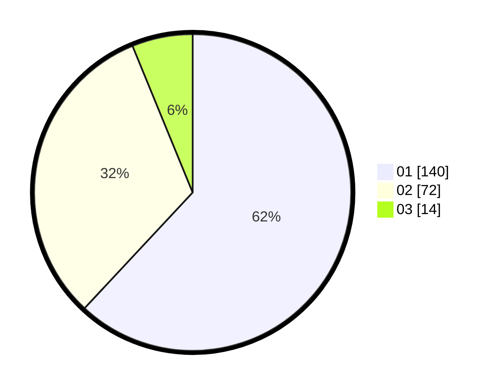

# Hasil

Hasil perolehan suara paslon dapat dilihat pada file paslon-01.txt, paslon-02.txt, dan paslon-03.txt.

Jika tidak ada, artinya data tersebut belum ada pada SIREKAP.

## Perolehan Suara

 * Paslon 01: **140**.
 * Paslon 02: **72**.
 * Paslon 03: **14**.

## Foto C Plano

https://sirekap-obj-formc.kpu.go.id/67ec/pemilu/ppwp/31/74/05/10/02/3174051002005-20240217-171957--1f7c3992-d837-4414-9473-fc848ba1475d.jpg

https://sirekap-obj-formc.kpu.go.id/67ec/pemilu/ppwp/31/74/05/10/02/3174051002005-20240217-172102--3cfcdff8-b769-4069-ba7f-a12c5313c51a.jpg

https://sirekap-obj-formc.kpu.go.id/67ec/pemilu/ppwp/31/74/05/10/02/3174051002005-20240217-172203--3a5fe106-1880-4ed5-a505-56756b896208.jpg
