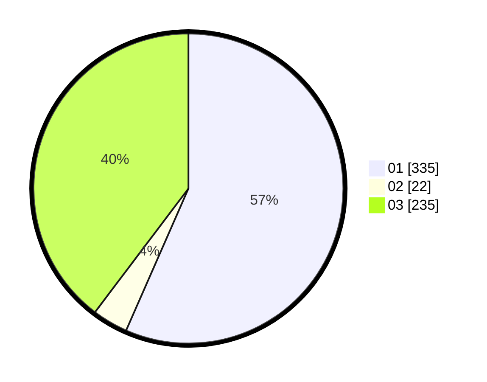

# Hasil

Hasil perolehan suara paslon dapat dilihat pada file paslon-01.txt, paslon-02.txt, dan paslon-03.txt.

Jika tidak ada, artinya data tersebut belum ada pada SIREKAP.

## Perolehan Suara

 * Paslon 01: **335**.
 * Paslon 02: **22**.
 * Paslon 03: **235**.

## Foto C Plano

https://sirekap-obj-formc.kpu.go.id/6534/pemilu/ppwp/31/74/05/10/02/3174051002008-20240217-200434--a3613e29-5001-4307-897b-10ca13eaf5f7.jpg

https://sirekap-obj-formc.kpu.go.id/6534/pemilu/ppwp/31/74/05/10/02/3174051002008-20240217-200624--947b77fd-1f00-48d8-bb76-e1750c419cfe.jpg

https://sirekap-obj-formc.kpu.go.id/6534/pemilu/ppwp/31/74/05/10/02/3174051002008-20240217-200730--e1df2056-c11b-469e-afcf-53ae812a3130.jpg

## DATA PEMILIH TETAP

Jumlah pemilih dalam DPT: **200**.
 * L: **342**.
 * P: **543**.

## DATA PENGGUNA HAK PILIH

Jumlah pengguna hak pilih dalam DPT: **8**.
 * L: **113**.
 * P: **134**.

Jumlah pengguna hak pilih dalam DPTb: **5**.
 * L: **6**.
 * P: **0**.

Jumlah pengguna hak pilih dalam DPK: **0**.
 * L: **0**.
 * P: **0**.

Jumlah pengguna hak pilih: **205**.
 * L: **114**.
 * P: **523**.

## JUMLAH SUARA SAH DAN TIDAK SAH

JUMLAH SELURUH SUARA SAH: **233**.

JUMLAH SUARA TIDAK SAH: **3**.

JUMLAH SELURUH SUARA SAH DAN SUARA TIDAK SAH: **235**.
