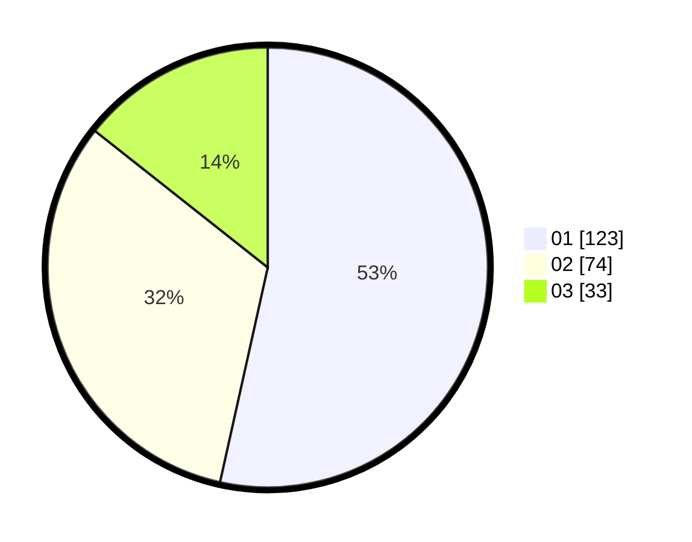

# Hasil

Hasil perolehan suara paslon dapat dilihat pada file paslon-01.txt, paslon-02.txt, dan paslon-03.txt.

Jika tidak ada, artinya data tersebut belum ada pada SIREKAP.

## Perolehan Suara

 * Paslon 01: **123**.
 * Paslon 02: **74**.
 * Paslon 03: **33**.

## Foto C Plano

https://sirekap-obj-formc.kpu.go.id/73cc/pemilu/ppwp/31/74/05/10/02/3174051002009-20240214-193529--f0ae40ee-e87d-48c4-bf54-2acf11494e39.jpg

https://sirekap-obj-formc.kpu.go.id/73cc/pemilu/ppwp/31/74/05/10/02/3174051002009-20240214-193546--bde438e4-5c00-44d3-a334-176c47f2deb9.jpg

https://sirekap-obj-formc.kpu.go.id/73cc/pemilu/ppwp/31/74/05/10/02/3174051002009-20240214-193602--db4361c2-83a9-41cc-87d5-24174bd14dea.jpg

## DATA PEMILIH TETAP

Jumlah pemilih dalam DPT: **274**.
 * L: **133**.
 * P: **141**.

## DATA PENGGUNA HAK PILIH

Jumlah pengguna hak pilih dalam DPT: **229**.
 * L: **104**.
 * P: **125**.

Jumlah pengguna hak pilih dalam DPTb: **4**.
 * L: **3**.
 * P: **1**.

Jumlah pengguna hak pilih dalam DPK: **0**.
 * L: **0**.
 * P: **0**.

Jumlah pengguna hak pilih: **233**.
 * L: **107**.
 * P: **126**.

## JUMLAH SUARA SAH DAN TIDAK SAH

JUMLAH SELURUH SUARA SAH: **230**.

JUMLAH SUARA TIDAK SAH: **3**.

JUMLAH SELURUH SUARA SAH DAN SUARA TIDAK SAH: **233**.
