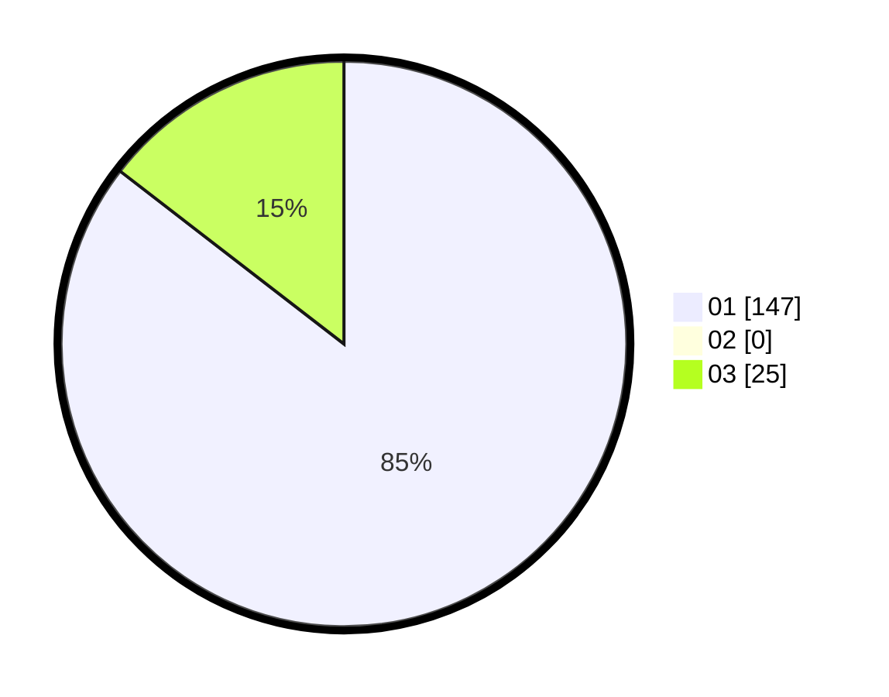

# Hasil

Hasil perolehan suara paslon dapat dilihat pada file paslon-01.txt, paslon-02.txt, dan paslon-03.txt.

Jika tidak ada, artinya data tersebut belum ada pada SIREKAP.

## Perolehan Suara

 * Paslon 01: **147**.
 * Paslon 02: **0**.
 * Paslon 03: **25**.

## Foto C Plano

https://sirekap-obj-formc.kpu.go.id/5b78/pemilu/ppwp/31/74/05/10/02/3174051002010-20240217-230327--9ce3d6a6-943e-47da-b23d-2f8732f7134a.jpg

https://sirekap-obj-formc.kpu.go.id/5b78/pemilu/ppwp/31/74/05/10/02/3174051002010-20240217-230859--46137734-c5c4-4093-aae5-8ffc427b2a09.jpg

https://sirekap-obj-formc.kpu.go.id/5b78/pemilu/ppwp/31/74/05/10/02/3174051002010-20240217-230950--2dacfae3-5a81-4e8b-820c-9bcb81bd4ab7.jpg

## DATA PEMILIH TETAP

Jumlah pemilih dalam DPT: **277**.
 * L: **134**.
 * P: **143**.

## DATA PENGGUNA HAK PILIH

Jumlah pengguna hak pilih dalam DPT: **250**.
 * L: **117**.
 * P: **133**.

Jumlah pengguna hak pilih dalam DPTb: **4**.
 * L: **2**.
 * P: **2**.

Jumlah pengguna hak pilih dalam DPK: **0**.
 * L: **0**.
 * P: **0**.

Jumlah pengguna hak pilih: **254**.
 * L: **119**.
 * P: **135**.

## JUMLAH SUARA SAH DAN TIDAK SAH

JUMLAH SELURUH SUARA SAH: **250**.

JUMLAH SUARA TIDAK SAH: **2**.

JUMLAH SELURUH SUARA SAH DAN SUARA TIDAK SAH: **254**.
