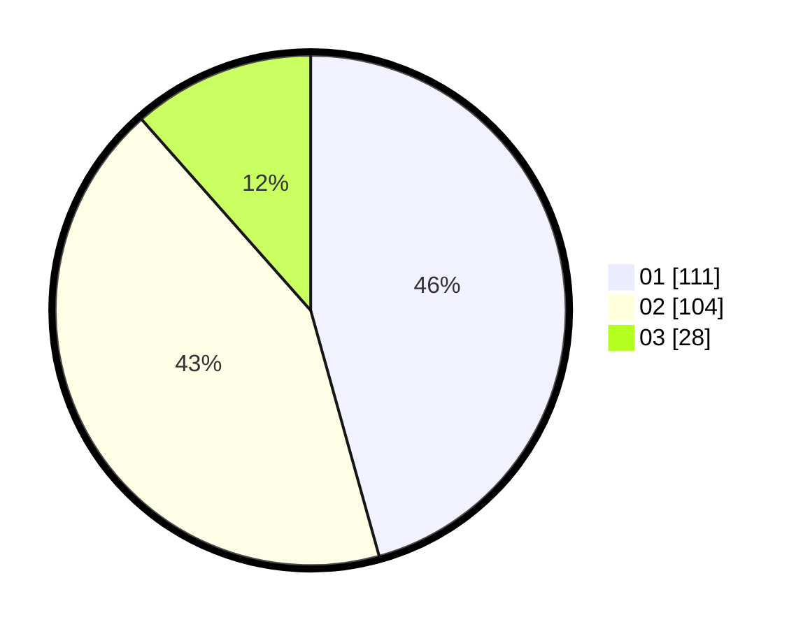

# Hasil

Hasil perolehan suara paslon dapat dilihat pada file paslon-01.txt, paslon-02.txt, dan paslon-03.txt.

Jika tidak ada, artinya data tersebut belum ada pada SIREKAP.

## Perolehan Suara

 * Paslon 01: **111**.
 * Paslon 02: **104**.
 * Paslon 03: **28**.

## Foto C Plano

https://sirekap-obj-formc.kpu.go.id/36e2/pemilu/ppwp/31/74/05/10/02/3174051002011-20240217-233937--18eb0bf3-2635-48e8-b91b-47f8101cb15b.jpg

https://sirekap-obj-formc.kpu.go.id/36e2/pemilu/ppwp/31/74/05/10/02/3174051002011-20240217-234058--e2902694-525d-4e79-a1d9-a0c831b3f092.jpg

https://sirekap-obj-formc.kpu.go.id/36e2/pemilu/ppwp/31/74/05/10/02/3174051002011-20240217-234306--58aef1f5-1a67-4bab-80cf-2e5e67c57c32.jpg

## DATA PEMILIH TETAP

Jumlah pemilih dalam DPT: **282**.
 * L: **131**.
 * P: **151**.

## DATA PENGGUNA HAK PILIH

Jumlah pengguna hak pilih dalam DPT: **228**.
 * L: **102**.
 * P: **125**.

Jumlah pengguna hak pilih dalam DPTb: **75**.
 * L: **5**.
 * P: **4**.

Jumlah pengguna hak pilih dalam DPK: **0**.
 * L: **0**.
 * P: **0**.

Jumlah pengguna hak pilih: **247**.
 * L: **108**.
 * P: **175**.

## JUMLAH SUARA SAH DAN TIDAK SAH

JUMLAH SELURUH SUARA SAH: **247**.

JUMLAH SUARA TIDAK SAH: **0**.

JUMLAH SELURUH SUARA SAH DAN SUARA TIDAK SAH: **243**.
