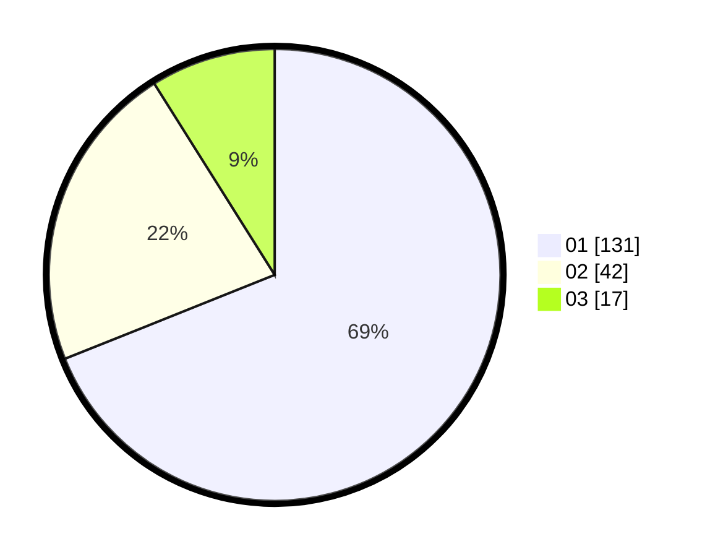

# Hasil

Hasil perolehan suara paslon dapat dilihat pada file paslon-01.txt, paslon-02.txt, dan paslon-03.txt.

Jika tidak ada, artinya data tersebut belum ada pada SIREKAP.

## Perolehan Suara

 * Paslon 01: **131**.
 * Paslon 02: **42**.
 * Paslon 03: **17**.

## Foto C Plano

https://sirekap-obj-formc.kpu.go.id/b5da/pemilu/ppwp/31/74/05/10/02/3174051002012-20240217-211445--f5215c8b-3c3e-4db7-823c-5f1ed9a5abb9.jpg

https://sirekap-obj-formc.kpu.go.id/b5da/pemilu/ppwp/31/74/05/10/02/3174051002012-20240217-211244--c6d795a6-05d2-44ec-a76d-d2daea4d76dd.jpg

https://sirekap-obj-formc.kpu.go.id/b5da/pemilu/ppwp/31/74/05/10/02/3174051002012-20240217-211545--9ec325a8-fe88-463e-af3f-6e6d9e588825.jpg

## DATA PEMILIH TETAP

Jumlah pemilih dalam DPT: **280**.
 * L: **139**.
 * P: **141**.

## DATA PENGGUNA HAK PILIH

Jumlah pengguna hak pilih dalam DPT: **230**.
 * L: **111**.
 * P: **119**.

Jumlah pengguna hak pilih dalam DPTb: **10**.
 * L: **7**.
 * P: **7**.

Jumlah pengguna hak pilih dalam DPK: **1**.
 * L: **1**.
 * P: **0**.

Jumlah pengguna hak pilih: **241**.
 * L: **115**.
 * P: **125**.

## JUMLAH SUARA SAH DAN TIDAK SAH

JUMLAH SELURUH SUARA SAH: **240**.

JUMLAH SUARA TIDAK SAH: **1**.

JUMLAH SELURUH SUARA SAH DAN SUARA TIDAK SAH: **241**.
