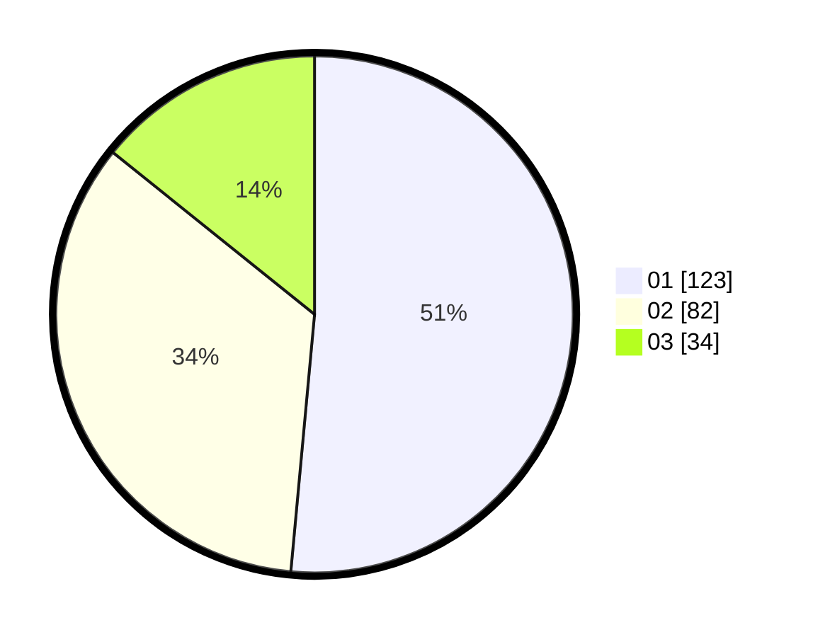

# Hasil

Hasil perolehan suara paslon dapat dilihat pada file paslon-01.txt, paslon-02.txt, dan paslon-03.txt.

Jika tidak ada, artinya data tersebut belum ada pada SIREKAP.

## Perolehan Suara

 * Paslon 01: **123**.
 * Paslon 02: **82**.
 * Paslon 03: **34**.

## Foto C Plano

https://sirekap-obj-formc.kpu.go.id/9942/pemilu/ppwp/31/74/05/10/02/3174051002015-20240218-130748--9dc370db-c60b-48b9-a37b-8763f640a48b.jpg

https://sirekap-obj-formc.kpu.go.id/9942/pemilu/ppwp/31/74/05/10/02/3174051002015-20240218-130833--3fb7d438-c96b-449b-b59e-360bbaf60419.jpg

https://sirekap-obj-formc.kpu.go.id/9942/pemilu/ppwp/31/74/05/10/02/3174051002015-20240218-130918--06b2f4fb-abe1-4930-8dbb-e453eb684765.jpg

## DATA PEMILIH TETAP

Jumlah pemilih dalam DPT: **291**.
 * L: **172**.
 * P: **157**.

## DATA PENGGUNA HAK PILIH

Jumlah pengguna hak pilih dalam DPT: **229**.
 * L: **107**.
 * P: **125**.

Jumlah pengguna hak pilih dalam DPTb: **17**.
 * L: **5**.
 * P: **8**.

Jumlah pengguna hak pilih dalam DPK: **2**.
 * L: **1**.
 * P: **1**.

Jumlah pengguna hak pilih: **244**.
 * L: **109**.
 * P: **175**.

## JUMLAH SUARA SAH DAN TIDAK SAH

JUMLAH SELURUH SUARA SAH: **279**.

JUMLAH SUARA TIDAK SAH: **5**.

JUMLAH SELURUH SUARA SAH DAN SUARA TIDAK SAH: **244**.
