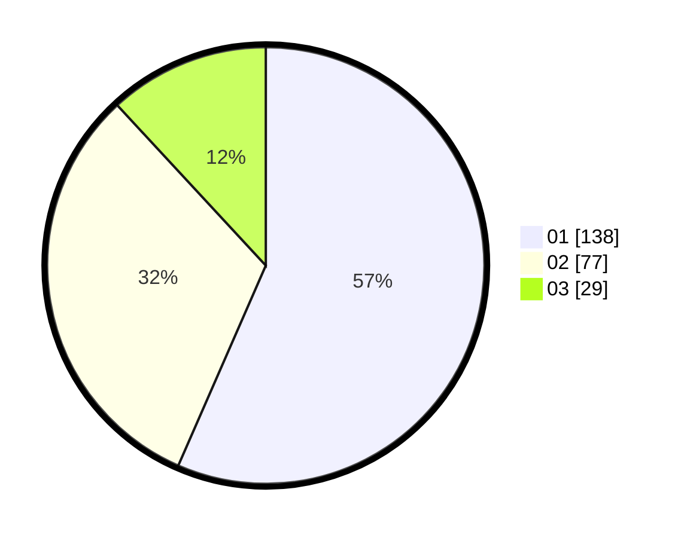

# Hasil

Hasil perolehan suara paslon dapat dilihat pada file paslon-01.txt, paslon-02.txt, dan paslon-03.txt.

Jika tidak ada, artinya data tersebut belum ada pada SIREKAP.

## Perolehan Suara

 * Paslon 01: **138**.
 * Paslon 02: **77**.
 * Paslon 03: **29**.

## Foto C Plano

https://sirekap-obj-formc.kpu.go.id/098d/pemilu/ppwp/31/74/05/10/02/3174051002025-20240214-194816--c9d6b5dd-f021-4944-b5ed-285ad1239a69.jpg

https://sirekap-obj-formc.kpu.go.id/098d/pemilu/ppwp/31/74/05/10/02/3174051002025-20240214-194849--57b19cca-a752-4319-b811-e7895c7e36a7.jpg

https://sirekap-obj-formc.kpu.go.id/098d/pemilu/ppwp/31/74/05/10/02/3174051002025-20240214-194903--a6432ec9-6e7a-4dbe-b7fa-51341aa084c2.jpg

## DATA PEMILIH TETAP

Jumlah pemilih dalam DPT: **291**.
 * L: **154**.
 * P: **137**.

## DATA PENGGUNA HAK PILIH

Jumlah pengguna hak pilih dalam DPT: **242**.
 * L: **122**.
 * P: **120**.

Jumlah pengguna hak pilih dalam DPTb: **5**.
 * L: **1**.
 * P: **4**.

Jumlah pengguna hak pilih dalam DPK: **1**.
 * L: **0**.
 * P: **1**.

Jumlah pengguna hak pilih: **248**.
 * L: **123**.
 * P: **125**.

## JUMLAH SUARA SAH DAN TIDAK SAH

JUMLAH SELURUH SUARA SAH: **244**.

JUMLAH SUARA TIDAK SAH: **4**.

JUMLAH SELURUH SUARA SAH DAN SUARA TIDAK SAH: **248**.
