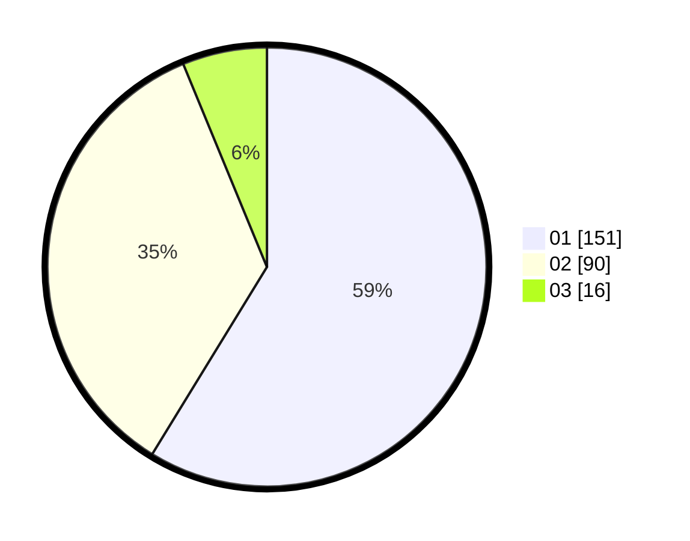

# Hasil

Hasil perolehan suara paslon dapat dilihat pada file paslon-01.txt, paslon-02.txt, dan paslon-03.txt.

Jika tidak ada, artinya data tersebut belum ada pada SIREKAP.

## Perolehan Suara

 * Paslon 01: **151**.
 * Paslon 02: **90**.
 * Paslon 03: **16**.

## Foto C Plano

https://sirekap-obj-formc.kpu.go.id/0862/pemilu/ppwp/31/74/05/10/02/3174051002040-20240214-213816--cfcb1c40-844f-4f35-9753-d39a78056880.jpg

https://sirekap-obj-formc.kpu.go.id/0862/pemilu/ppwp/31/74/05/10/02/3174051002040-20240214-213822--c8704a36-3a46-4fdf-87ef-9062589bcb4a.jpg

https://sirekap-obj-formc.kpu.go.id/0862/pemilu/ppwp/31/74/05/10/02/3174051002040-20240214-213827--a786b72a-c595-4a56-b7a0-20f711dd96b8.jpg

## DATA PEMILIH TETAP

Jumlah pemilih dalam DPT: **291**.
 * L: **153**.
 * P: **138**.

## DATA PENGGUNA HAK PILIH

Jumlah pengguna hak pilih dalam DPT: **256**.
 * L: **129**.
 * P: **127**.

Jumlah pengguna hak pilih dalam DPTb: **5**.
 * L: **1**.
 * P: **4**.

Jumlah pengguna hak pilih dalam DPK: **0**.
 * L: **0**.
 * P: **0**.

Jumlah pengguna hak pilih: **261**.
 * L: **130**.
 * P: **131**.

## JUMLAH SUARA SAH DAN TIDAK SAH

JUMLAH SELURUH SUARA SAH: **257**.

JUMLAH SUARA TIDAK SAH: **4**.

JUMLAH SELURUH SUARA SAH DAN SUARA TIDAK SAH: **261**.
