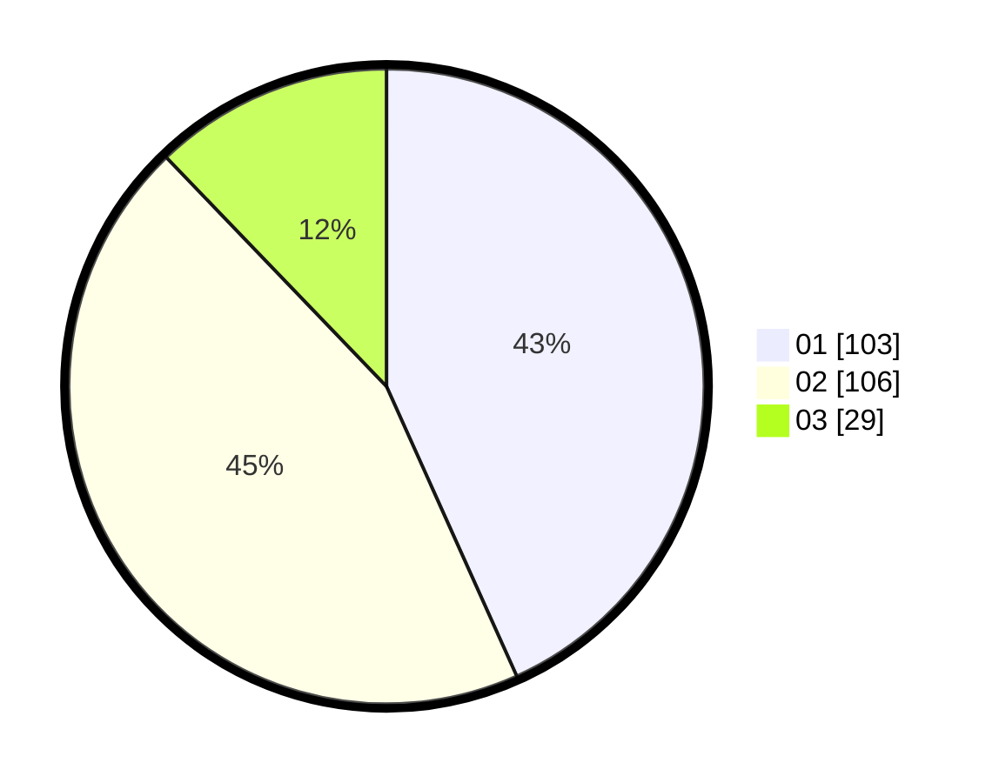

# Hasil

Hasil perolehan suara paslon dapat dilihat pada file paslon-01.txt, paslon-02.txt, dan paslon-03.txt.

Jika tidak ada, artinya data tersebut belum ada pada SIREKAP.

## Perolehan Suara

 * Paslon 01: **103**.
 * Paslon 02: **106**.
 * Paslon 03: **29**.

## Foto C Plano

https://sirekap-obj-formc.kpu.go.id/6296/pemilu/ppwp/31/74/05/10/02/3174051002074-20240214-230054--a9b6b290-ec1f-48ba-b0a5-cd3036389bee.jpg

https://sirekap-obj-formc.kpu.go.id/6296/pemilu/ppwp/31/74/05/10/02/3174051002074-20240214-195136--693d106b-1da6-4424-b631-be265c4cee7a.jpg

https://sirekap-obj-formc.kpu.go.id/6296/pemilu/ppwp/31/74/05/10/02/3174051002074-20240214-195248--a73ba520-6ac8-48c3-8a10-102044fa062a.jpg
