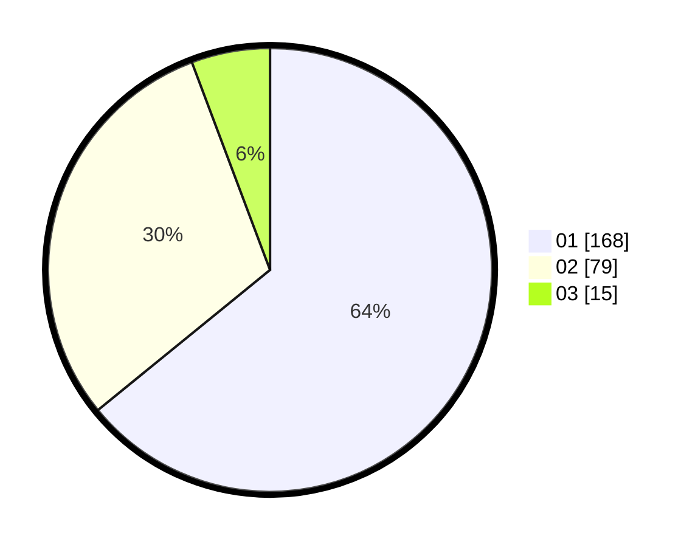

# Hasil

Hasil perolehan suara paslon dapat dilihat pada file paslon-01.txt, paslon-02.txt, dan paslon-03.txt.

Jika tidak ada, artinya data tersebut belum ada pada SIREKAP.

## Perolehan Suara

 * Paslon 01: **168**.
 * Paslon 02: **79**.
 * Paslon 03: **15**.

## Foto C Plano

https://sirekap-obj-formc.kpu.go.id/4cd1/pemilu/ppwp/31/74/05/10/02/3174051002079-20240214-221931--936b3bdc-55d3-48de-85fa-26d09aa8cc75.jpg

https://sirekap-obj-formc.kpu.go.id/4cd1/pemilu/ppwp/31/74/05/10/02/3174051002079-20240214-222211--fbb45d5f-20f1-45b6-ab65-3c51126dd429.jpg

https://sirekap-obj-formc.kpu.go.id/4cd1/pemilu/ppwp/31/74/05/10/02/3174051002079-20240214-222819--adba445c-e5d8-4b4b-b09a-4404597578c0.jpg

## DATA PEMILIH TETAP

Jumlah pemilih dalam DPT: **285**.
 * L: **138**.
 * P: **147**.

## DATA PENGGUNA HAK PILIH

Jumlah pengguna hak pilih dalam DPT: **256**.
 * L: **123**.
 * P: **133**.

Jumlah pengguna hak pilih dalam DPTb: **7**.
 * L: **4**.
 * P: **3**.

Jumlah pengguna hak pilih dalam DPK: **0**.
 * L: **0**.
 * P: **0**.

Jumlah pengguna hak pilih: **263**.
 * L: **127**.
 * P: **136**.

## JUMLAH SUARA SAH DAN TIDAK SAH

JUMLAH SELURUH SUARA SAH: **262**.

JUMLAH SUARA TIDAK SAH: **1**.

JUMLAH SELURUH SUARA SAH DAN SUARA TIDAK SAH: **263**.
