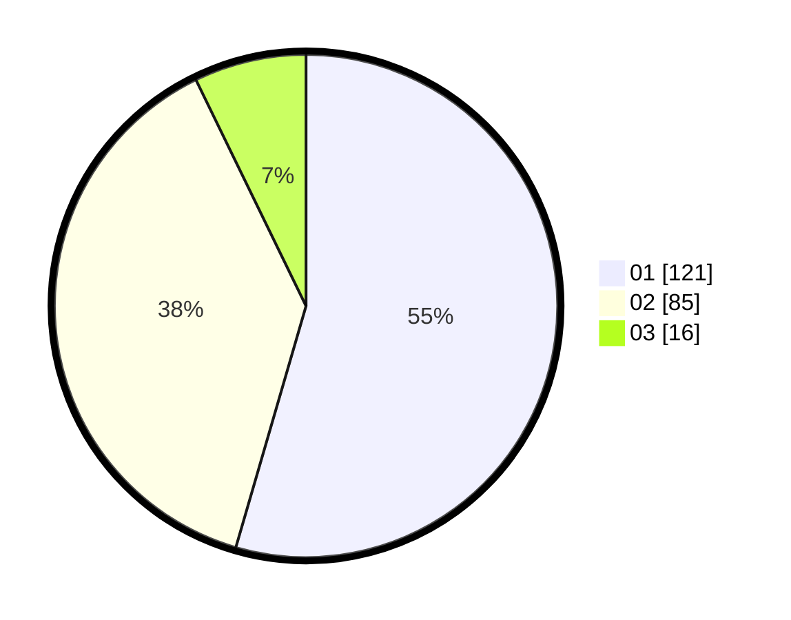

# Hasil

Hasil perolehan suara paslon dapat dilihat pada file paslon-01.txt, paslon-02.txt, dan paslon-03.txt.

Jika tidak ada, artinya data tersebut belum ada pada SIREKAP.

## Perolehan Suara

 * Paslon 01: **121**.
 * Paslon 02: **85**.
 * Paslon 03: **16**.

## Foto C Plano

https://sirekap-obj-formc.kpu.go.id/7874/pemilu/ppwp/31/74/05/10/02/3174051002082-20240214-190556--82bcb140-d744-4751-a9d6-292e0a19d076.jpg

https://sirekap-obj-formc.kpu.go.id/7874/pemilu/ppwp/31/74/05/10/02/3174051002082-20240214-190845--81d85185-2a94-4396-b139-989491dd2f35.jpg

https://sirekap-obj-formc.kpu.go.id/7874/pemilu/ppwp/31/74/05/10/02/3174051002082-20240214-191059--d7361df2-d794-4863-b95e-1e44acdddb6d.jpg

## DATA PEMILIH TETAP

Jumlah pemilih dalam DPT: **266**.
 * L: **128**.
 * P: **138**.

## DATA PENGGUNA HAK PILIH

Jumlah pengguna hak pilih dalam DPT: **222**.
 * L: **105**.
 * P: **117**.

Jumlah pengguna hak pilih dalam DPTb: **2**.
 * L: **0**.
 * P: **2**.

Jumlah pengguna hak pilih dalam DPK: **0**.
 * L: **0**.
 * P: **0**.

Jumlah pengguna hak pilih: **224**.
 * L: **105**.
 * P: **119**.

## JUMLAH SUARA SAH DAN TIDAK SAH

JUMLAH SELURUH SUARA SAH: **222**.

JUMLAH SUARA TIDAK SAH: **2**.

JUMLAH SELURUH SUARA SAH DAN SUARA TIDAK SAH: **224**.
