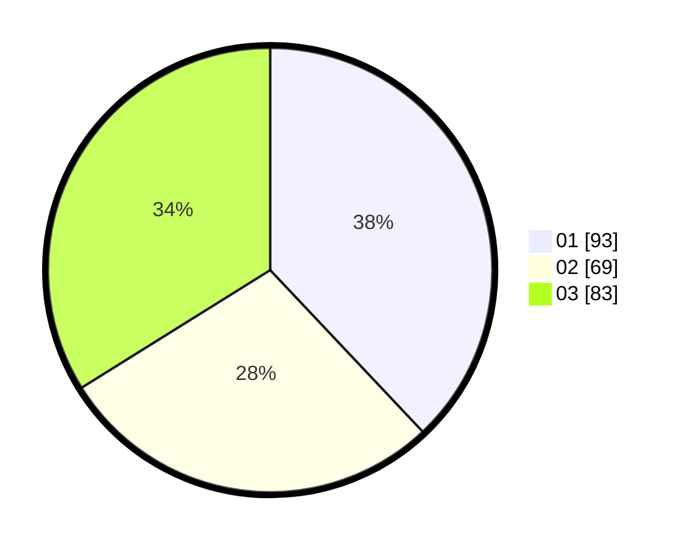

# Hasil

Hasil perolehan suara paslon dapat dilihat pada file paslon-01.txt, paslon-02.txt, dan paslon-03.txt.

Jika tidak ada, artinya data tersebut belum ada pada SIREKAP.

## Perolehan Suara

 * Paslon 01: **93**.
 * Paslon 02: **69**.
 * Paslon 03: **83**.

## Foto C Plano

https://sirekap-obj-formc.kpu.go.id/8690/pemilu/ppwp/31/74/05/10/02/3174051002094-20240214-225324--78d302f2-cf58-4a6a-84c3-eab01440f830.jpg

https://sirekap-obj-formc.kpu.go.id/8690/pemilu/ppwp/31/74/05/10/02/3174051002094-20240214-222531--3f062e23-ad5e-41c8-a22f-14487b19211d.jpg

https://sirekap-obj-formc.kpu.go.id/8690/pemilu/ppwp/31/74/05/10/02/3174051002094-20240214-225609--fb597552-8447-449f-ba4e-9690569cee89.jpg
