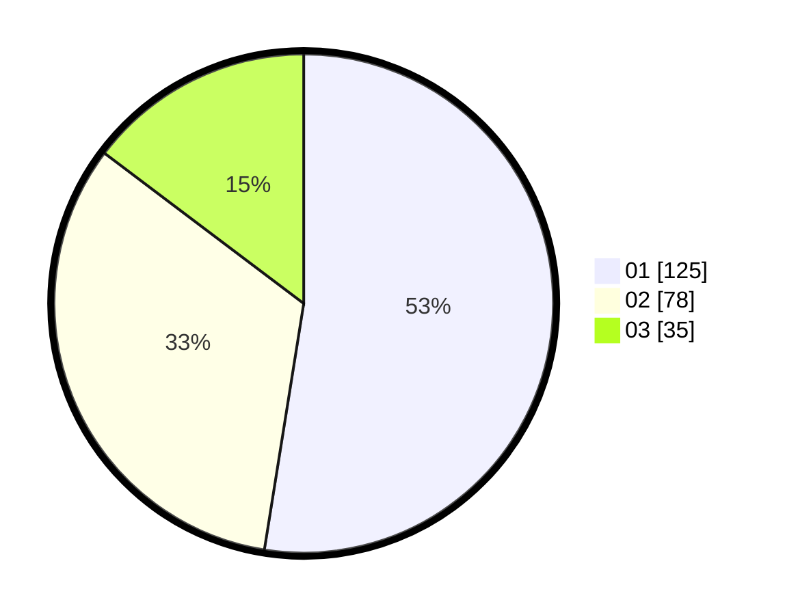

# Hasil

Hasil perolehan suara paslon dapat dilihat pada file paslon-01.txt, paslon-02.txt, dan paslon-03.txt.

Jika tidak ada, artinya data tersebut belum ada pada SIREKAP.

## Perolehan Suara

 * Paslon 01: **125**.
 * Paslon 02: **78**.
 * Paslon 03: **35**.

## Foto C Plano

https://sirekap-obj-formc.kpu.go.id/16c8/pemilu/ppwp/31/74/05/10/02/3174051002102-20240214-213419--556ad94c-b0d8-4b2e-9034-10d5df5aab42.jpg

https://sirekap-obj-formc.kpu.go.id/16c8/pemilu/ppwp/31/74/05/10/02/3174051002102-20240214-213623--5bb76164-b1c7-4b77-baa9-f24c9d75f242.jpg

https://sirekap-obj-formc.kpu.go.id/16c8/pemilu/ppwp/31/74/05/10/02/3174051002102-20240214-213539--0ebfd476-6fce-41cd-afd9-3e201500cc91.jpg

## DATA PEMILIH TETAP

Jumlah pemilih dalam DPT: **256**.
 * L: **122**.
 * P: **134**.

## DATA PENGGUNA HAK PILIH

Jumlah pengguna hak pilih dalam DPT: **223**.
 * L: **105**.
 * P: **118**.

Jumlah pengguna hak pilih dalam DPTb: **14**.
 * L: **4**.
 * P: **10**.

Jumlah pengguna hak pilih dalam DPK: **2**.
 * L: **1**.
 * P: **1**.

Jumlah pengguna hak pilih: **239**.
 * L: **110**.
 * P: **129**.

## JUMLAH SUARA SAH DAN TIDAK SAH

JUMLAH SELURUH SUARA SAH: **238**.

JUMLAH SUARA TIDAK SAH: **1**.

JUMLAH SELURUH SUARA SAH DAN SUARA TIDAK SAH: **239**.
