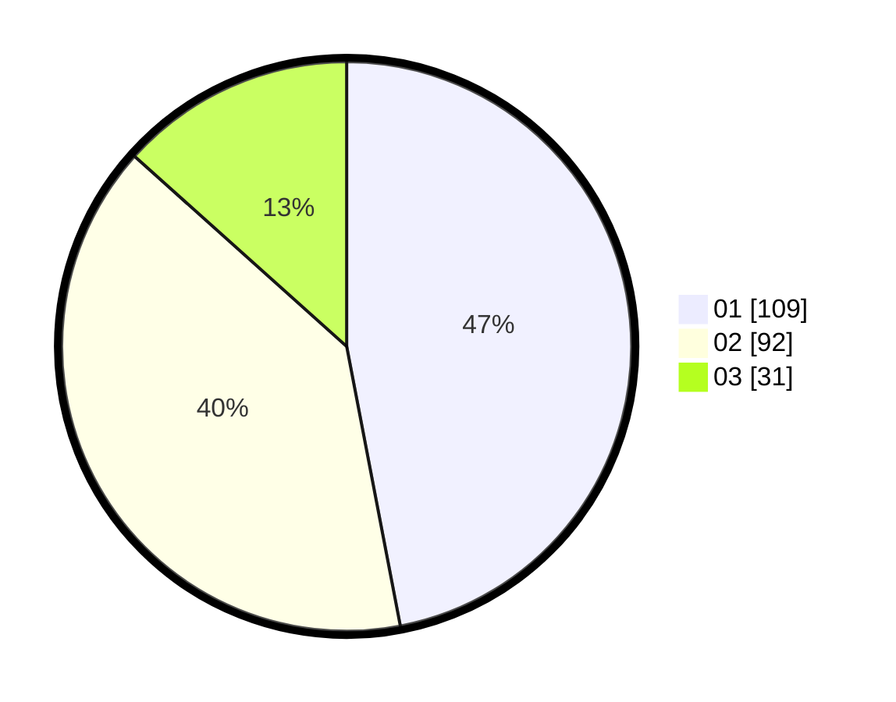

# Hasil

Hasil perolehan suara paslon dapat dilihat pada file paslon-01.txt, paslon-02.txt, dan paslon-03.txt.

Jika tidak ada, artinya data tersebut belum ada pada SIREKAP.

## Perolehan Suara

 * Paslon 01: **109**.
 * Paslon 02: **92**.
 * Paslon 03: **31**.

## Foto C Plano

https://sirekap-obj-formc.kpu.go.id/ffd6/pemilu/ppwp/31/74/05/10/02/3174051002103-20240214-235742--51dfae9c-e660-4112-b27f-f1089ab0dc69.jpg

https://sirekap-obj-formc.kpu.go.id/ffd6/pemilu/ppwp/31/74/05/10/02/3174051002103-20240215-000134--a315f72c-e403-4c95-b6c3-e5649b4eb746.jpg

https://sirekap-obj-formc.kpu.go.id/ffd6/pemilu/ppwp/31/74/05/10/02/3174051002103-20240214-234926--6b5fdde3-31a2-447d-bf44-4e60eadc1a16.jpg
