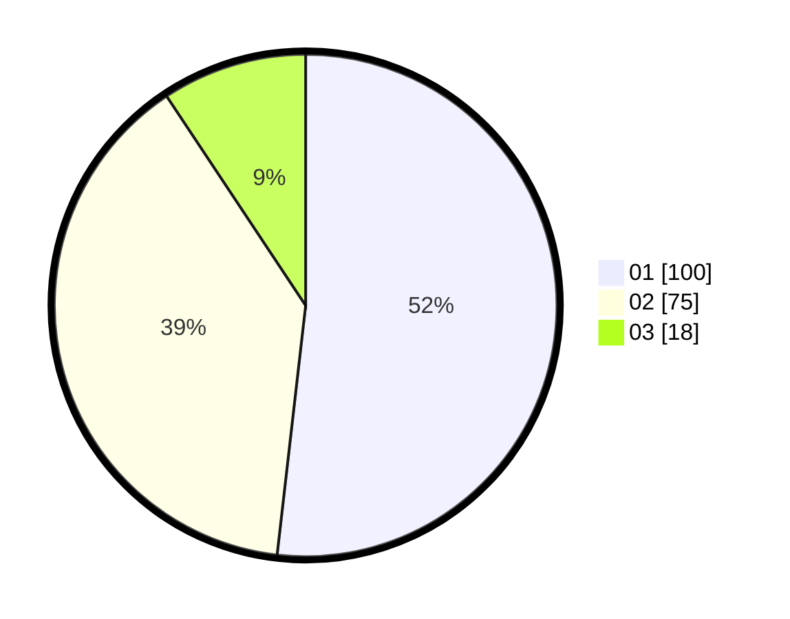

# Hasil

Hasil perolehan suara paslon dapat dilihat pada file paslon-01.txt, paslon-02.txt, dan paslon-03.txt.

Jika tidak ada, artinya data tersebut belum ada pada SIREKAP.

## Perolehan Suara

 * Paslon 01: **100**.
 * Paslon 02: **75**.
 * Paslon 03: **18**.

## Foto C Plano

https://sirekap-obj-formc.kpu.go.id/0e4e/pemilu/ppwp/31/74/05/10/02/3174051002104-20240216-050911--6a3e5da4-aa11-44cb-a024-51ee2eb0126d.jpg

https://sirekap-obj-formc.kpu.go.id/0e4e/pemilu/ppwp/31/74/05/10/02/3174051002104-20240216-050921--3f2a66e3-ecfc-45ce-8fef-0b80e02aacf3.jpg

https://sirekap-obj-formc.kpu.go.id/0e4e/pemilu/ppwp/31/74/05/10/02/3174051002104-20240216-050920--8755fcce-6421-4ba3-b74f-b3a101349e93.jpg

## DATA PEMILIH TETAP

Jumlah pemilih dalam DPT: **239**.
 * L: **110**.
 * P: **129**.

## DATA PENGGUNA HAK PILIH

Jumlah pengguna hak pilih dalam DPT: **188**.
 * L: **86**.
 * P: **102**.

Jumlah pengguna hak pilih dalam DPTb: **5**.
 * L: **2**.
 * P: **3**.

Jumlah pengguna hak pilih dalam DPK: **2**.
 * L: **0**.
 * P: **2**.

Jumlah pengguna hak pilih: **195**.
 * L: **88**.
 * P: **107**.

## JUMLAH SUARA SAH DAN TIDAK SAH

JUMLAH SELURUH SUARA SAH: **193**.

JUMLAH SUARA TIDAK SAH: **2**.

JUMLAH SELURUH SUARA SAH DAN SUARA TIDAK SAH: **195**.
