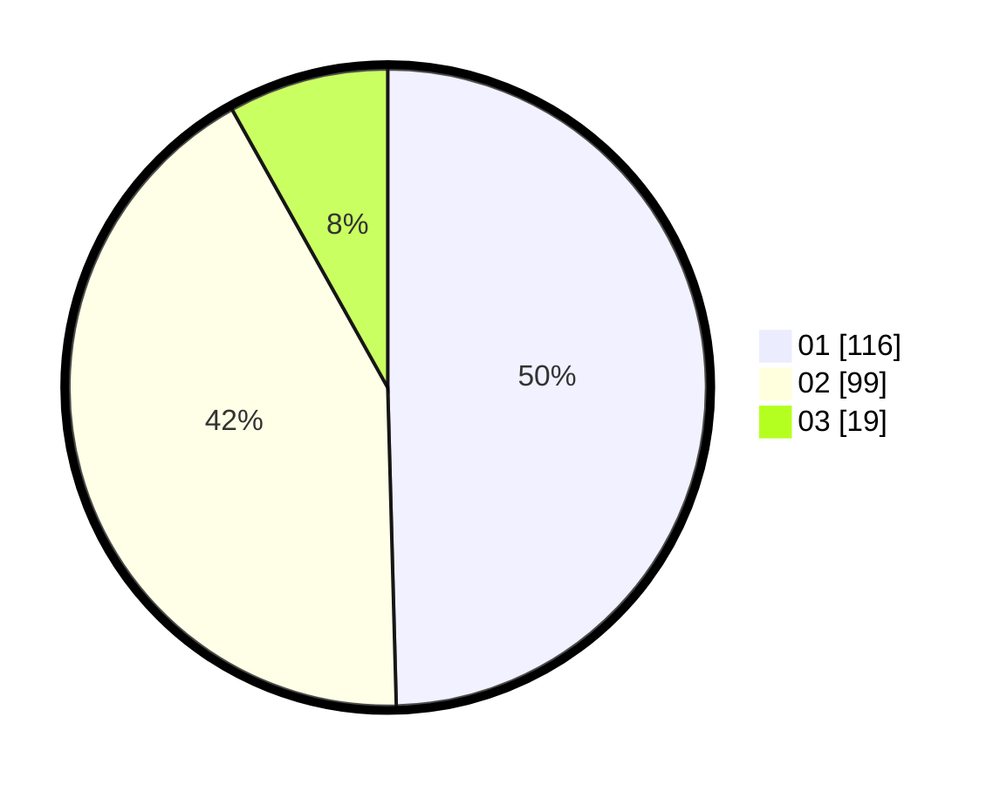

# Hasil

Hasil perolehan suara paslon dapat dilihat pada file paslon-01.txt, paslon-02.txt, dan paslon-03.txt.

Jika tidak ada, artinya data tersebut belum ada pada SIREKAP.

## Perolehan Suara

 * Paslon 01: **116**.
 * Paslon 02: **99**.
 * Paslon 03: **19**.

## Foto C Plano

https://sirekap-obj-formc.kpu.go.id/0811/pemilu/ppwp/31/74/05/10/02/3174051002109-20240214-214134--b3e78dba-f9ec-4ea2-9330-b9bbb18bf622.jpg

https://sirekap-obj-formc.kpu.go.id/0811/pemilu/ppwp/31/74/05/10/02/3174051002109-20240216-034619--3dd92e05-9e0e-4c13-9b41-6ab9cde7c22c.jpg

https://sirekap-obj-formc.kpu.go.id/0811/pemilu/ppwp/31/74/05/10/02/3174051002109-20240214-214504--8b04626c-845f-4499-8989-3ad8e632d46d.jpg
