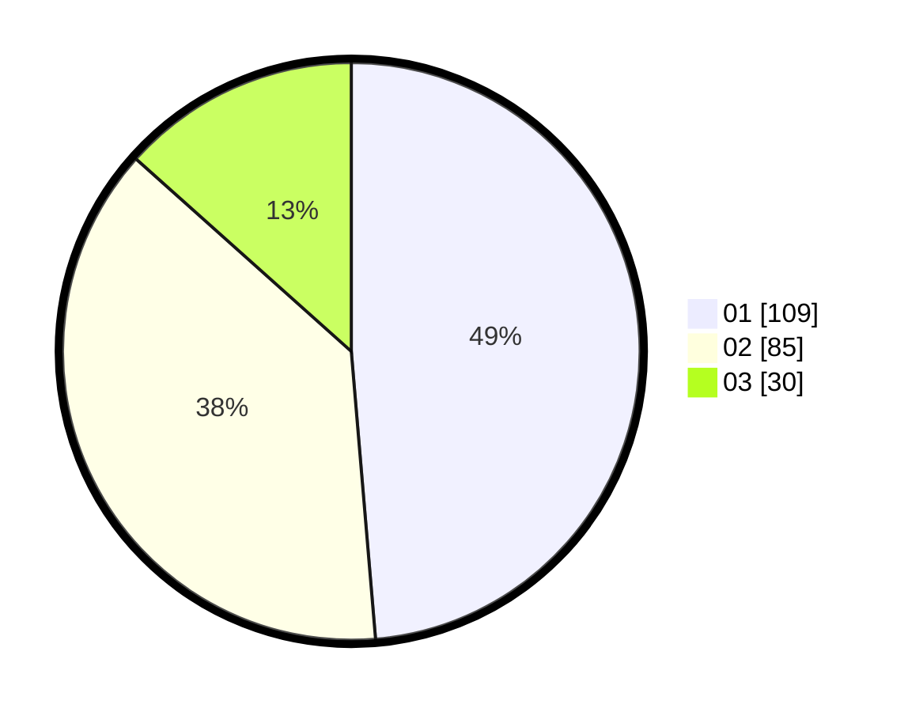

# Hasil

Hasil perolehan suara paslon dapat dilihat pada file paslon-01.txt, paslon-02.txt, dan paslon-03.txt.

Jika tidak ada, artinya data tersebut belum ada pada SIREKAP.

## Perolehan Suara

 * Paslon 01: **109**.
 * Paslon 02: **85**.
 * Paslon 03: **30**.

## Foto C Plano

https://sirekap-obj-formc.kpu.go.id/3236/pemilu/ppwp/31/74/05/10/02/3174051002117-20240214-203526--2fa95f39-9062-4de6-8758-24e948ab08fa.jpg

https://sirekap-obj-formc.kpu.go.id/3236/pemilu/ppwp/31/74/05/10/02/3174051002117-20240214-204009--56571c8f-3608-4c5d-b3fb-950158d16dd3.jpg

https://sirekap-obj-formc.kpu.go.id/3236/pemilu/ppwp/31/74/05/10/02/3174051002117-20240216-092208--32193570-6e43-4bdc-a15b-03a3db5d67c8.jpg

## DATA PEMILIH TETAP

Jumlah pemilih dalam DPT: **300**.
 * L: **153**.
 * P: **147**.

## DATA PENGGUNA HAK PILIH

Jumlah pengguna hak pilih dalam DPT: **226**.
 * L: **109**.
 * P: **117**.

Jumlah pengguna hak pilih dalam DPTb: **2**.
 * L: **0**.
 * P: **2**.

Jumlah pengguna hak pilih dalam DPK: **2**.
 * L: **1**.
 * P: **1**.

Jumlah pengguna hak pilih: **230**.
 * L: **110**.
 * P: **120**.

## JUMLAH SUARA SAH DAN TIDAK SAH

JUMLAH SELURUH SUARA SAH: **224**.

JUMLAH SUARA TIDAK SAH: **6**.

JUMLAH SELURUH SUARA SAH DAN SUARA TIDAK SAH: **230**.
