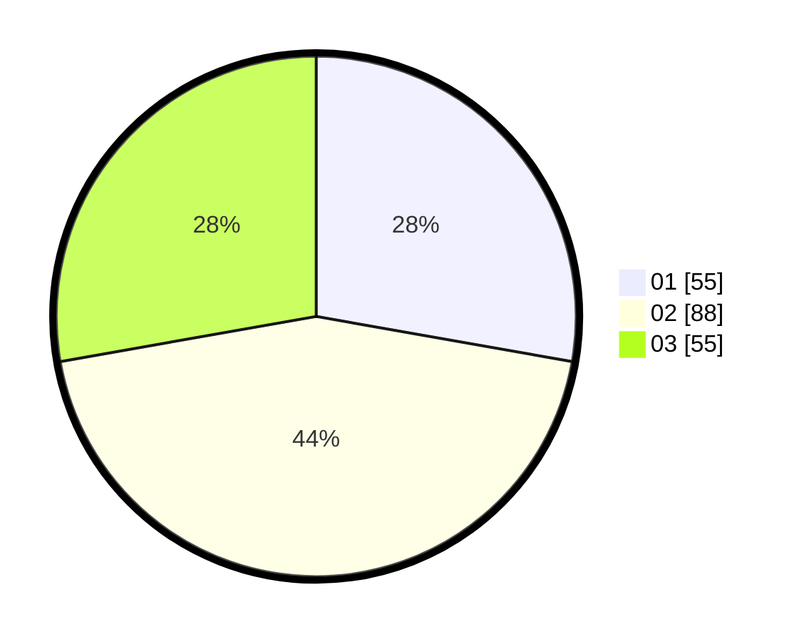

# Hasil

Hasil perolehan suara paslon dapat dilihat pada file paslon-01.txt, paslon-02.txt, dan paslon-03.txt.

Jika tidak ada, artinya data tersebut belum ada pada SIREKAP.

## Perolehan Suara

 * Paslon 01: **55**.
 * Paslon 02: **88**.
 * Paslon 03: **55**.

## Foto C Plano

https://sirekap-obj-formc.kpu.go.id/7d1d/pemilu/ppwp/31/74/05/10/02/3174051002119-20240218-200216--0aaf7309-8f2b-42b5-9c7e-578c6731a167.jpg

https://sirekap-obj-formc.kpu.go.id/7d1d/pemilu/ppwp/31/74/05/10/02/3174051002119-20240219-185446--7b43541d-db06-4210-ae05-c0a042910926.jpg

https://sirekap-obj-formc.kpu.go.id/7d1d/pemilu/ppwp/31/74/05/10/02/3174051002119-20240218-200855--3959c51f-cef9-42fb-8eba-5095daa2fdee.jpg

## DATA PEMILIH TETAP

Jumlah pemilih dalam DPT: **255**.
 * L: **117**.
 * P: **138**.

## DATA PENGGUNA HAK PILIH

Jumlah pengguna hak pilih dalam DPT: **185**.
 * L: **84**.
 * P: **101**.

Jumlah pengguna hak pilih dalam DPTb: **12**.
 * L: **4**.
 * P: **8**.

Jumlah pengguna hak pilih dalam DPK: **5**.
 * L: **2**.
 * P: **3**.

Jumlah pengguna hak pilih: **202**.
 * L: **90**.
 * P: **112**.

## JUMLAH SUARA SAH DAN TIDAK SAH

JUMLAH SELURUH SUARA SAH: **198**.

JUMLAH SUARA TIDAK SAH: **4**.

JUMLAH SELURUH SUARA SAH DAN SUARA TIDAK SAH: **202**.
