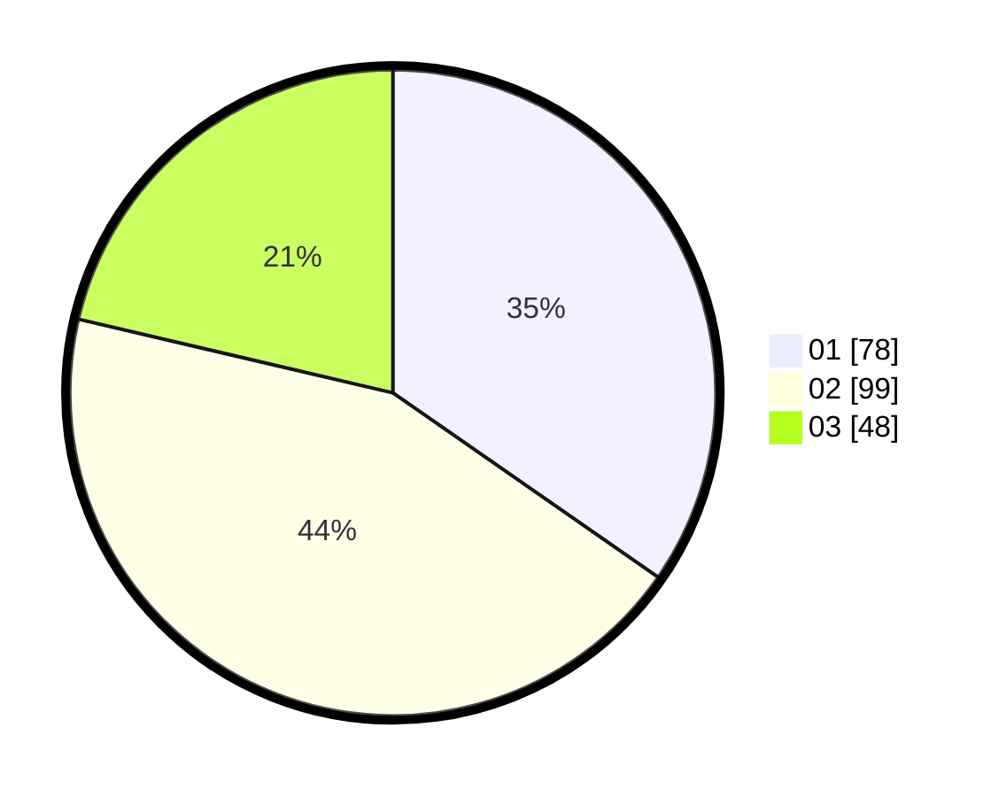

# Hasil

Hasil perolehan suara paslon dapat dilihat pada file paslon-01.txt, paslon-02.txt, dan paslon-03.txt.

Jika tidak ada, artinya data tersebut belum ada pada SIREKAP.

## Perolehan Suara

 * Paslon 01: **78**.
 * Paslon 02: **99**.
 * Paslon 03: **48**.

## Foto C Plano

https://sirekap-obj-formc.kpu.go.id/2242/pemilu/ppwp/31/74/05/10/02/3174051002122-20240217-173522--10a54555-1876-4375-89ca-b894b7598a26.jpg

https://sirekap-obj-formc.kpu.go.id/2242/pemilu/ppwp/31/74/05/10/02/3174051002122-20240217-174155--b6a7e6b9-7595-4f77-9cf7-f2c8f2f8076d.jpg

https://sirekap-obj-formc.kpu.go.id/2242/pemilu/ppwp/31/74/05/10/02/3174051002122-20240217-174357--ad36cc1a-7883-464b-8b9b-941a66f88ba6.jpg

## DATA PEMILIH TETAP

Jumlah pemilih dalam DPT: **259**.
 * L: **111**.
 * P: **148**.

## DATA PENGGUNA HAK PILIH

Jumlah pengguna hak pilih dalam DPT: **210**.
 * L: **86**.
 * P: **124**.

Jumlah pengguna hak pilih dalam DPTb: **18**.
 * L: **9**.
 * P: **9**.

Jumlah pengguna hak pilih dalam DPK: **0**.
 * L: **0**.
 * P: **0**.

Jumlah pengguna hak pilih: **228**.
 * L: **95**.
 * P: **133**.

## JUMLAH SUARA SAH DAN TIDAK SAH

JUMLAH SELURUH SUARA SAH: **225**.

JUMLAH SUARA TIDAK SAH: **3**.

JUMLAH SELURUH SUARA SAH DAN SUARA TIDAK SAH: **228**.
