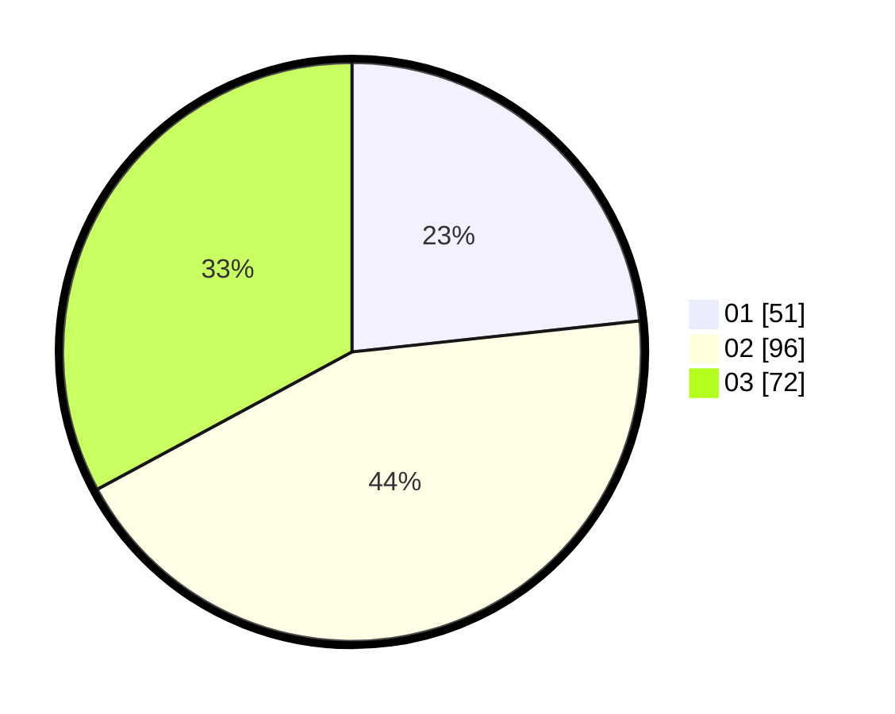

# Hasil

Hasil perolehan suara paslon dapat dilihat pada file paslon-01.txt, paslon-02.txt, dan paslon-03.txt.

Jika tidak ada, artinya data tersebut belum ada pada SIREKAP.

## Perolehan Suara

 * Paslon 01: **51**.
 * Paslon 02: **96**.
 * Paslon 03: **72**.

## Foto C Plano

https://sirekap-obj-formc.kpu.go.id/79a9/pemilu/ppwp/31/74/05/10/02/3174051002123-20240215-033518--629bea5b-969c-47b5-8b7b-e4cba4f81a39.jpg

https://sirekap-obj-formc.kpu.go.id/79a9/pemilu/ppwp/31/74/05/10/02/3174051002123-20240215-033702--a21af525-8cb4-4bb9-985d-14a664089cdf.jpg

https://sirekap-obj-formc.kpu.go.id/79a9/pemilu/ppwp/31/74/05/10/02/3174051002123-20240215-033812--8a478962-6aa2-40fa-a388-11421fb68621.jpg
