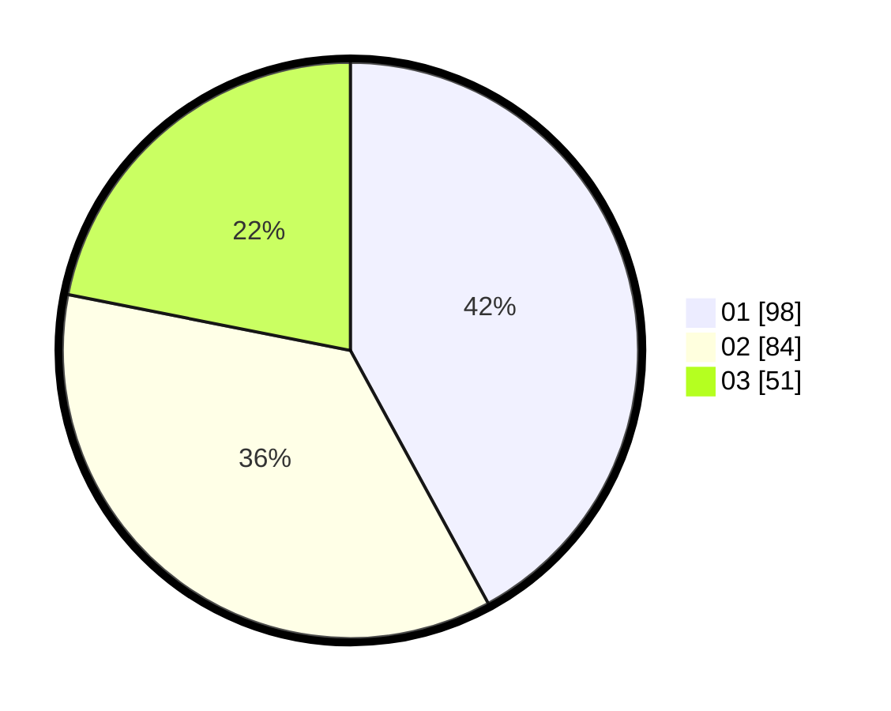

# Hasil

Hasil perolehan suara paslon dapat dilihat pada file paslon-01.txt, paslon-02.txt, dan paslon-03.txt.

Jika tidak ada, artinya data tersebut belum ada pada SIREKAP.

## Perolehan Suara

 * Paslon 01: **98**.
 * Paslon 02: **84**.
 * Paslon 03: **51**.

## Foto C Plano

https://sirekap-obj-formc.kpu.go.id/945a/pemilu/ppwp/31/74/05/10/02/3174051002129-20240215-011954--c07c6074-d01e-4674-90bf-58521fcc139c.jpg

https://sirekap-obj-formc.kpu.go.id/945a/pemilu/ppwp/31/74/05/10/02/3174051002129-20240215-012120--eed4f5df-c448-44a1-a4b1-026562129e62.jpg

https://sirekap-obj-formc.kpu.go.id/945a/pemilu/ppwp/31/74/05/10/02/3174051002129-20240215-012249--897923d8-6ed9-4d3a-9ce4-950612bd3a9d.jpg

## DATA PEMILIH TETAP

Jumlah pemilih dalam DPT: **260**.
 * L: **122**.
 * P: **138**.

## DATA PENGGUNA HAK PILIH

Jumlah pengguna hak pilih dalam DPT: **218**.
 * L: **105**.
 * P: **113**.

Jumlah pengguna hak pilih dalam DPTb: **19**.
 * L: **7**.
 * P: **12**.

Jumlah pengguna hak pilih dalam DPK: **2**.
 * L: **2**.
 * P: **0**.

Jumlah pengguna hak pilih: **239**.
 * L: **114**.
 * P: **125**.

## JUMLAH SUARA SAH DAN TIDAK SAH

JUMLAH SELURUH SUARA SAH: **233**.

JUMLAH SUARA TIDAK SAH: **6**.

JUMLAH SELURUH SUARA SAH DAN SUARA TIDAK SAH: **239**.
