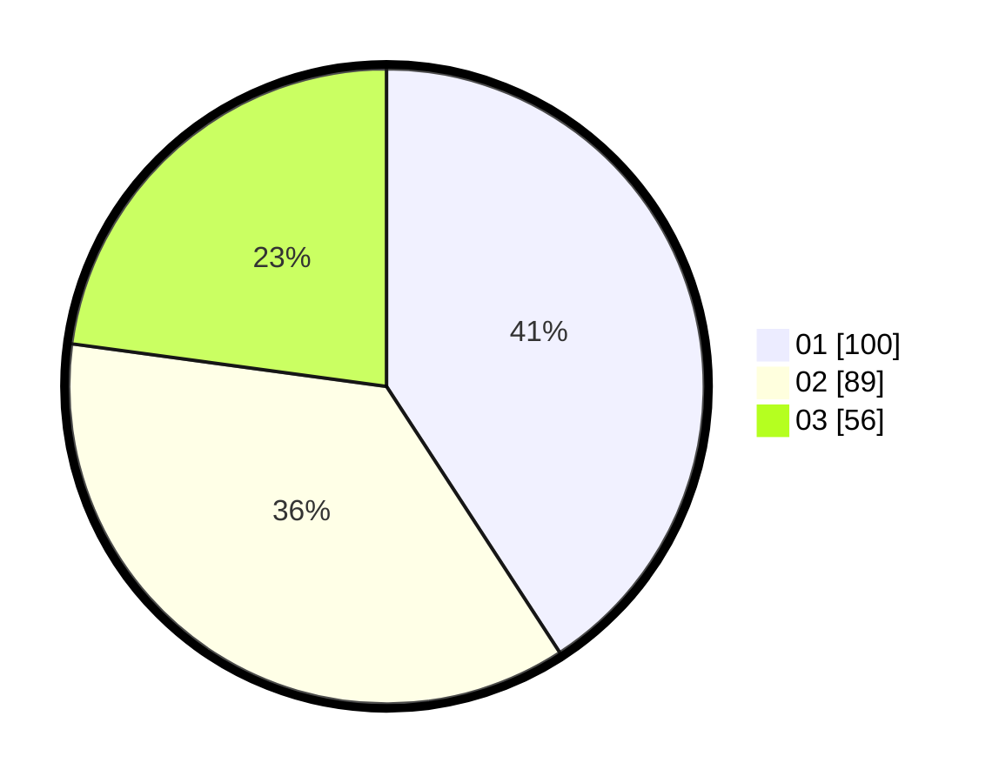

# Hasil

Hasil perolehan suara paslon dapat dilihat pada file paslon-01.txt, paslon-02.txt, dan paslon-03.txt.

Jika tidak ada, artinya data tersebut belum ada pada SIREKAP.

## Perolehan Suara

 * Paslon 01: **100**.
 * Paslon 02: **89**.
 * Paslon 03: **56**.

## Foto C Plano

https://sirekap-obj-formc.kpu.go.id/c354/pemilu/ppwp/31/74/05/10/02/3174051002132-20240215-012357--4c7ec98f-1ac1-4781-86ff-1f097664ac34.jpg

https://sirekap-obj-formc.kpu.go.id/c354/pemilu/ppwp/31/74/05/10/02/3174051002132-20240215-150457--f1e3ab20-afd4-471a-8b27-3728f2e94643.jpg

https://sirekap-obj-formc.kpu.go.id/c354/pemilu/ppwp/31/74/05/10/02/3174051002132-20240215-012524--143d1737-f1a8-40e2-b57f-a0a34723a806.jpg

## DATA PEMILIH TETAP

Jumlah pemilih dalam DPT: **264**.
 * L: **123**.
 * P: **141**.

## DATA PENGGUNA HAK PILIH

Jumlah pengguna hak pilih dalam DPT: **227**.
 * L: **100**.
 * P: **127**.

Jumlah pengguna hak pilih dalam DPTb: **15**.
 * L: **7**.
 * P: **8**.

Jumlah pengguna hak pilih dalam DPK: **5**.
 * L: **4**.
 * P: **1**.

Jumlah pengguna hak pilih: **247**.
 * L: **111**.
 * P: **136**.

## JUMLAH SUARA SAH DAN TIDAK SAH

JUMLAH SELURUH SUARA SAH: **245**.

JUMLAH SUARA TIDAK SAH: **2**.

JUMLAH SELURUH SUARA SAH DAN SUARA TIDAK SAH: **247**.
