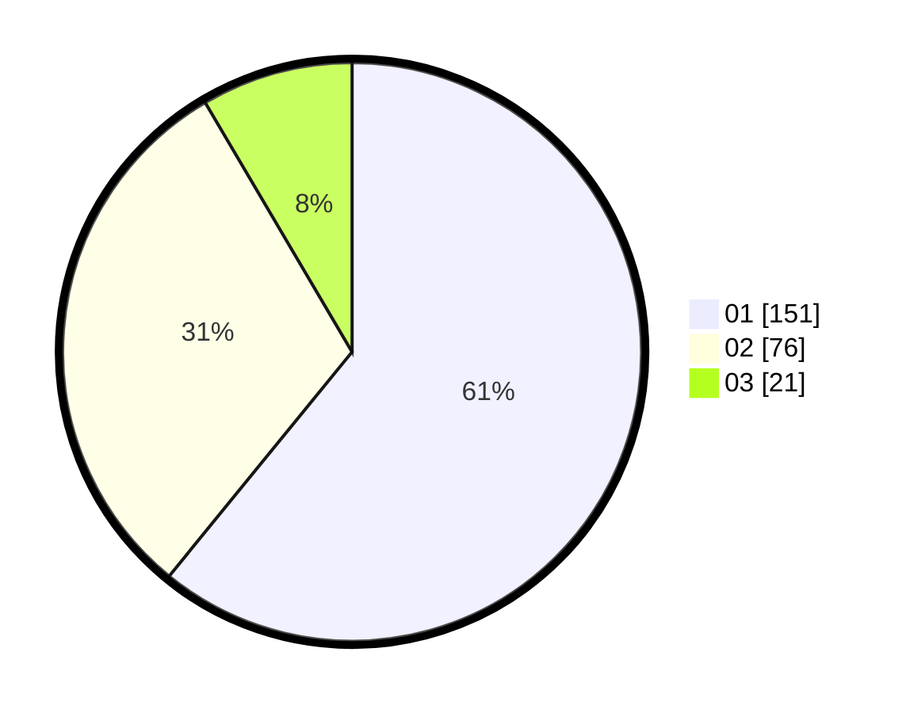

# Hasil

Hasil perolehan suara paslon dapat dilihat pada file paslon-01.txt, paslon-02.txt, dan paslon-03.txt.

Jika tidak ada, artinya data tersebut belum ada pada SIREKAP.

## Perolehan Suara

 * Paslon 01: **151**.
 * Paslon 02: **76**.
 * Paslon 03: **21**.

## Foto C Plano

https://sirekap-obj-formc.kpu.go.id/7193/pemilu/ppwp/31/74/05/10/02/3174051002136-20240217-134417--ef3ffdb5-7e04-4aa6-8b95-423b3b43d1bf.jpg

https://sirekap-obj-formc.kpu.go.id/7193/pemilu/ppwp/31/74/05/10/02/3174051002136-20240217-134602--354733f7-8b8e-41df-a8b4-e8e1f7cfb6a0.jpg

https://sirekap-obj-formc.kpu.go.id/7193/pemilu/ppwp/31/74/05/10/02/3174051002136-20240217-134655--2683c938-d69e-4a6a-b9f9-d35765b2da84.jpg

## DATA PEMILIH TETAP

Jumlah pemilih dalam DPT: **279**.
 * L: **129**.
 * P: **150**.

## DATA PENGGUNA HAK PILIH

Jumlah pengguna hak pilih dalam DPT: **233**.
 * L: **106**.
 * P: **127**.

Jumlah pengguna hak pilih dalam DPTb: **10**.
 * L: **2**.
 * P: **8**.

Jumlah pengguna hak pilih dalam DPK: **6**.
 * L: **2**.
 * P: **4**.

Jumlah pengguna hak pilih: **249**.
 * L: **110**.
 * P: **139**.

## JUMLAH SUARA SAH DAN TIDAK SAH

JUMLAH SELURUH SUARA SAH: **248**.

JUMLAH SUARA TIDAK SAH: **1**.

JUMLAH SELURUH SUARA SAH DAN SUARA TIDAK SAH: **249**.
