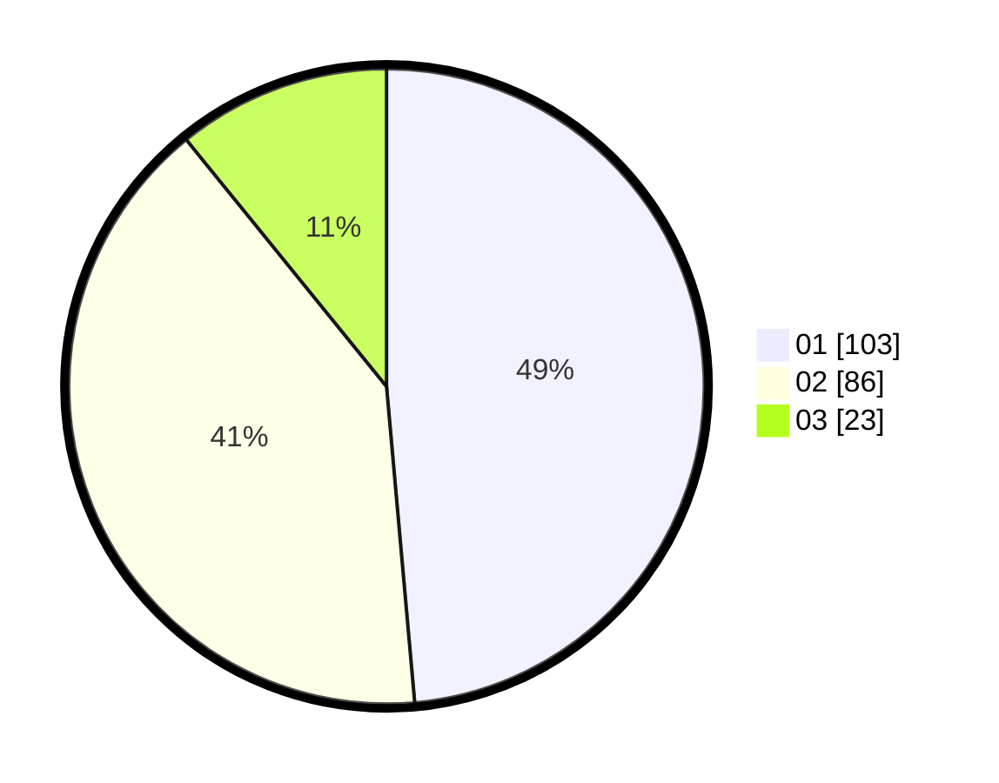

# Hasil

Hasil perolehan suara paslon dapat dilihat pada file paslon-01.txt, paslon-02.txt, dan paslon-03.txt.

Jika tidak ada, artinya data tersebut belum ada pada SIREKAP.

## Perolehan Suara

 * Paslon 01: **103**.
 * Paslon 02: **86**.
 * Paslon 03: **23**.

## Foto C Plano

https://sirekap-obj-formc.kpu.go.id/d584/pemilu/ppwp/31/74/05/10/02/3174051002147-20240215-002832--7bc6d962-bedc-48bb-a392-9dac98467e93.jpg

https://sirekap-obj-formc.kpu.go.id/d584/pemilu/ppwp/31/74/05/10/02/3174051002147-20240215-003042--9b69f93f-8d49-4a59-b734-51f368f85ce6.jpg

https://sirekap-obj-formc.kpu.go.id/d584/pemilu/ppwp/31/74/05/10/02/3174051002147-20240215-003315--1bb25c66-af3b-48ba-8d1b-104ff0ea5a93.jpg

## DATA PEMILIH TETAP

Jumlah pemilih dalam DPT: **266**.
 * L: **136**.
 * P: **130**.

## DATA PENGGUNA HAK PILIH

Jumlah pengguna hak pilih dalam DPT: **204**.
 * L: **97**.
 * P: **107**.

Jumlah pengguna hak pilih dalam DPTb: **12**.
 * L: **2**.
 * P: **10**.

Jumlah pengguna hak pilih dalam DPK: **0**.
 * L: **0**.
 * P: **0**.

Jumlah pengguna hak pilih: **216**.
 * L: **99**.
 * P: **117**.

## JUMLAH SUARA SAH DAN TIDAK SAH

JUMLAH SELURUH SUARA SAH: **212**.

JUMLAH SUARA TIDAK SAH: **4**.

JUMLAH SELURUH SUARA SAH DAN SUARA TIDAK SAH: **216**.
