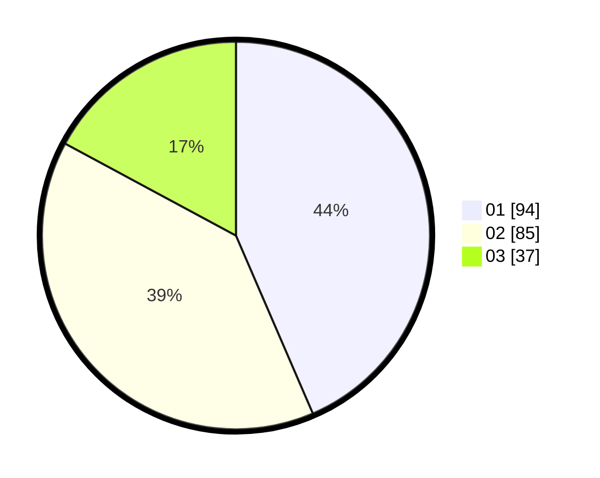

# Hasil

Hasil perolehan suara paslon dapat dilihat pada file paslon-01.txt, paslon-02.txt, dan paslon-03.txt.

Jika tidak ada, artinya data tersebut belum ada pada SIREKAP.

## Perolehan Suara

 * Paslon 01: **94**.
 * Paslon 02: **85**.
 * Paslon 03: **37**.

## Foto C Plano

https://sirekap-obj-formc.kpu.go.id/2cc3/pemilu/ppwp/31/74/05/10/02/3174051002148-20240214-190923--fe2269e8-516b-44f9-aa12-1c1a14b0663e.jpg

https://sirekap-obj-formc.kpu.go.id/2cc3/pemilu/ppwp/31/74/05/10/02/3174051002148-20240214-191022--c26a4ab3-f6d9-4fe6-9993-be2dc69cf6a2.jpg

https://sirekap-obj-formc.kpu.go.id/2cc3/pemilu/ppwp/31/74/05/10/02/3174051002148-20240214-191036--986477a3-3bbf-4a61-942a-4db92e42ad12.jpg

## DATA PEMILIH TETAP

Jumlah pemilih dalam DPT: **265**.
 * L: **130**.
 * P: **135**.

## DATA PENGGUNA HAK PILIH

Jumlah pengguna hak pilih dalam DPT: **196**.
 * L: **92**.
 * P: **104**.

Jumlah pengguna hak pilih dalam DPTb: **20**.
 * L: **8**.
 * P: **12**.

Jumlah pengguna hak pilih dalam DPK: **0**.
 * L: **0**.
 * P: **0**.

Jumlah pengguna hak pilih: **216**.
 * L: **100**.
 * P: **116**.

## JUMLAH SUARA SAH DAN TIDAK SAH

JUMLAH SELURUH SUARA SAH: **216**.

JUMLAH SUARA TIDAK SAH: **0**.

JUMLAH SELURUH SUARA SAH DAN SUARA TIDAK SAH: **216**.
