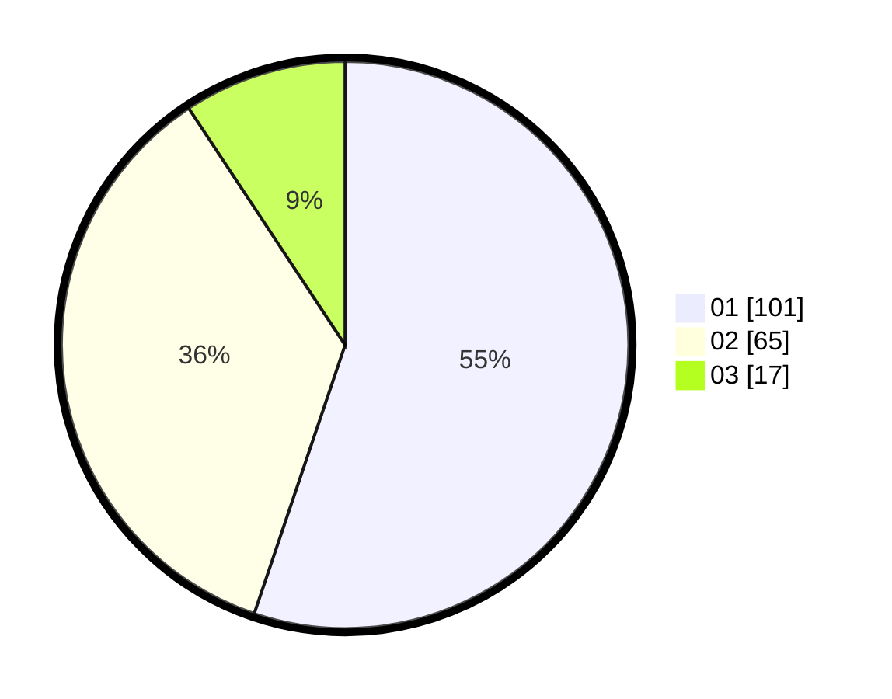

# Hasil

Hasil perolehan suara paslon dapat dilihat pada file paslon-01.txt, paslon-02.txt, dan paslon-03.txt.

Jika tidak ada, artinya data tersebut belum ada pada SIREKAP.

## Perolehan Suara

 * Paslon 01: **101**.
 * Paslon 02: **65**.
 * Paslon 03: **17**.

## Foto C Plano

https://sirekap-obj-formc.kpu.go.id/0c7e/pemilu/ppwp/31/74/05/10/02/3174051002154-20240214-225542--100a9a89-3deb-490b-b838-d42035e31e2d.jpg

https://sirekap-obj-formc.kpu.go.id/0c7e/pemilu/ppwp/31/74/05/10/02/3174051002154-20240214-230906--306ce56a-3ede-4d29-a09a-0bd58970ad6a.jpg

https://sirekap-obj-formc.kpu.go.id/0c7e/pemilu/ppwp/31/74/05/10/02/3174051002154-20240214-230206--4fb2bbef-966c-406a-b559-77d7c644e2a9.jpg
