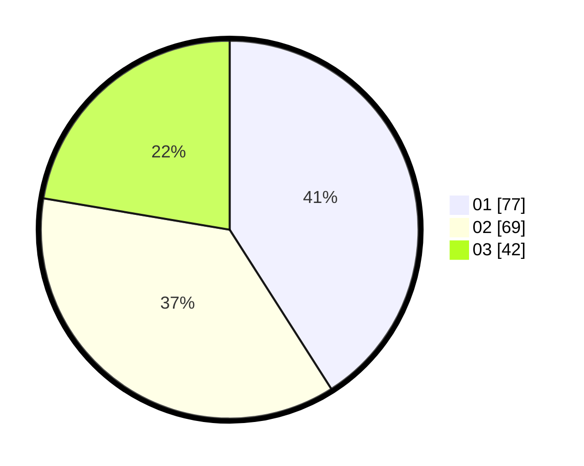

# Hasil

Hasil perolehan suara paslon dapat dilihat pada file paslon-01.txt, paslon-02.txt, dan paslon-03.txt.

Jika tidak ada, artinya data tersebut belum ada pada SIREKAP.

## Perolehan Suara

 * Paslon 01: **77**.
 * Paslon 02: **69**.
 * Paslon 03: **42**.

## Foto C Plano

https://sirekap-obj-formc.kpu.go.id/1de5/pemilu/ppwp/31/74/05/10/02/3174051002156-20240214-191131--9ab35e95-98cd-4037-b876-a6e38a040013.jpg

https://sirekap-obj-formc.kpu.go.id/1de5/pemilu/ppwp/31/74/05/10/02/3174051002156-20240214-155816--0a2da3a7-efe0-4c3a-8193-51dae53b50d5.jpg

https://sirekap-obj-formc.kpu.go.id/1de5/pemilu/ppwp/31/74/05/10/02/3174051002156-20240214-160140--b24ea023-b6c1-41be-a783-62ebff44b124.jpg

## DATA PEMILIH TETAP

Jumlah pemilih dalam DPT: **238**.
 * L: **125**.
 * P: **113**.

## DATA PENGGUNA HAK PILIH

Jumlah pengguna hak pilih dalam DPT: **194**.
 * L: **99**.
 * P: **95**.

Jumlah pengguna hak pilih dalam DPTb: **1**.
 * L: **0**.
 * P: **1**.

Jumlah pengguna hak pilih dalam DPK: **1**.
 * L: **0**.
 * P: **1**.

Jumlah pengguna hak pilih: **196**.
 * L: **99**.
 * P: **97**.

## JUMLAH SUARA SAH DAN TIDAK SAH

JUMLAH SELURUH SUARA SAH: **188**.

JUMLAH SUARA TIDAK SAH: **8**.

JUMLAH SELURUH SUARA SAH DAN SUARA TIDAK SAH: **196**.
