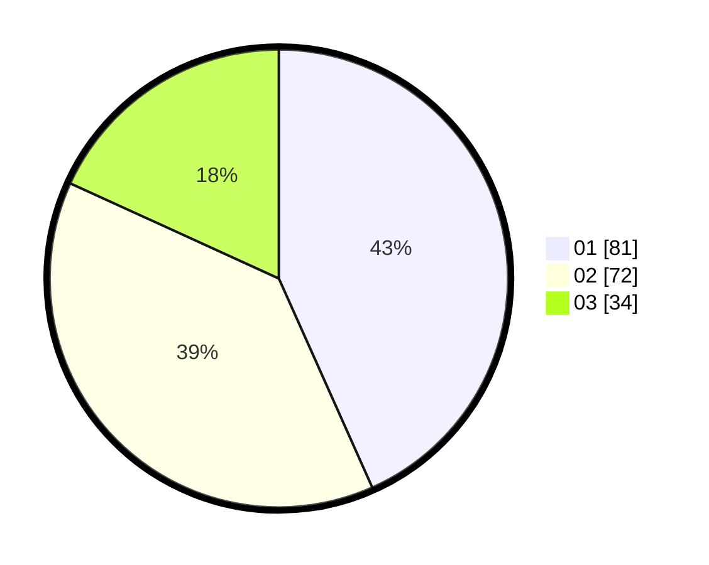

# Hasil

Hasil perolehan suara paslon dapat dilihat pada file paslon-01.txt, paslon-02.txt, dan paslon-03.txt.

Jika tidak ada, artinya data tersebut belum ada pada SIREKAP.

## Perolehan Suara

 * Paslon 01: **81**.
 * Paslon 02: **72**.
 * Paslon 03: **34**.

## Foto C Plano

https://sirekap-obj-formc.kpu.go.id/337e/pemilu/ppwp/31/74/05/10/02/3174051002157-20240214-185403--b17446ab-93fc-483e-8f15-d01cbe633c10.jpg

https://sirekap-obj-formc.kpu.go.id/337e/pemilu/ppwp/31/74/05/10/02/3174051002157-20240214-185406--1bf6be7d-21dc-4cc8-8a20-e4e2da83662d.jpg
