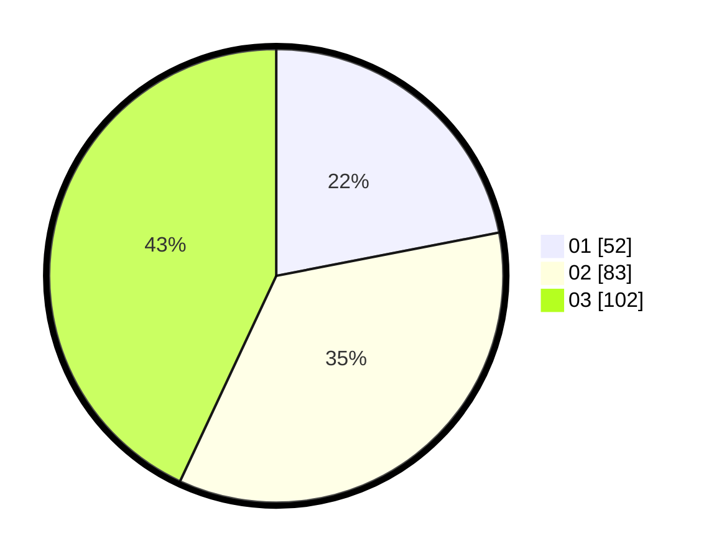

# Hasil

Hasil perolehan suara paslon dapat dilihat pada file paslon-01.txt, paslon-02.txt, dan paslon-03.txt.

Jika tidak ada, artinya data tersebut belum ada pada SIREKAP.

## Perolehan Suara

 * Paslon 01: **52**.
 * Paslon 02: **83**.
 * Paslon 03: **102**.

## Foto C Plano

https://sirekap-obj-formc.kpu.go.id/9407/pemilu/ppwp/31/74/05/10/02/3174051002159-20240214-155558--4dbd5e24-adfa-43ce-b549-acd1224e075b.jpg

https://sirekap-obj-formc.kpu.go.id/9407/pemilu/ppwp/31/74/05/10/02/3174051002159-20240215-004058--17c9ec8e-ec9c-4ad2-9699-4881633f92e8.jpg

https://sirekap-obj-formc.kpu.go.id/9407/pemilu/ppwp/31/74/05/10/02/3174051002159-20240215-004117--3df05a62-b8b3-4587-a277-b6299f38894e.jpg

## DATA PEMILIH TETAP

Jumlah pemilih dalam DPT: **294**.
 * L: **130**.
 * P: **164**.

## DATA PENGGUNA HAK PILIH

Jumlah pengguna hak pilih dalam DPT: **212**.
 * L: **100**.
 * P: **112**.

Jumlah pengguna hak pilih dalam DPTb: **25**.
 * L: **12**.
 * P: **13**.

Jumlah pengguna hak pilih dalam DPK: **4**.
 * L: **1**.
 * P: **3**.

Jumlah pengguna hak pilih: **241**.
 * L: **113**.
 * P: **128**.

## JUMLAH SUARA SAH DAN TIDAK SAH

JUMLAH SELURUH SUARA SAH: **237**.

JUMLAH SUARA TIDAK SAH: **4**.

JUMLAH SELURUH SUARA SAH DAN SUARA TIDAK SAH: **241**.
