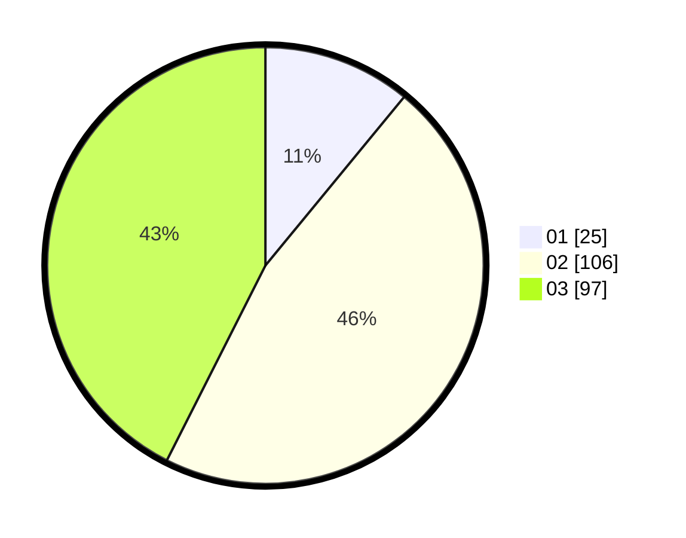

# Hasil

Hasil perolehan suara paslon dapat dilihat pada file paslon-01.txt, paslon-02.txt, dan paslon-03.txt.

Jika tidak ada, artinya data tersebut belum ada pada SIREKAP.

## Perolehan Suara

 * Paslon 01: **25**.
 * Paslon 02: **106**.
 * Paslon 03: **97**.

## Foto C Plano

https://sirekap-obj-formc.kpu.go.id/0338/pemilu/ppwp/31/74/05/10/02/3174051002164-20240217-162433--3fc28fe1-7172-42b8-bb34-261a1d60b793.jpg

https://sirekap-obj-formc.kpu.go.id/0338/pemilu/ppwp/31/74/05/10/02/3174051002164-20240217-162551--ac80a03d-3770-434a-b9f3-dc8eeaf60993.jpg

https://sirekap-obj-formc.kpu.go.id/0338/pemilu/ppwp/31/74/05/10/02/3174051002164-20240217-162734--4f10bd7c-02f8-43a4-91f4-a1ca67ce9981.jpg

## DATA PEMILIH TETAP

Jumlah pemilih dalam DPT: **275**.
 * L: **118**.
 * P: **157**.

## DATA PENGGUNA HAK PILIH

Jumlah pengguna hak pilih dalam DPT: **210**.
 * L: **88**.
 * P: **122**.

Jumlah pengguna hak pilih dalam DPTb: **19**.
 * L: **10**.
 * P: **9**.

Jumlah pengguna hak pilih dalam DPK: **0**.
 * L: **0**.
 * P: **0**.

Jumlah pengguna hak pilih: **229**.
 * L: **98**.
 * P: **131**.

## JUMLAH SUARA SAH DAN TIDAK SAH

JUMLAH SELURUH SUARA SAH: **228**.

JUMLAH SUARA TIDAK SAH: **1**.

JUMLAH SELURUH SUARA SAH DAN SUARA TIDAK SAH: **229**.
