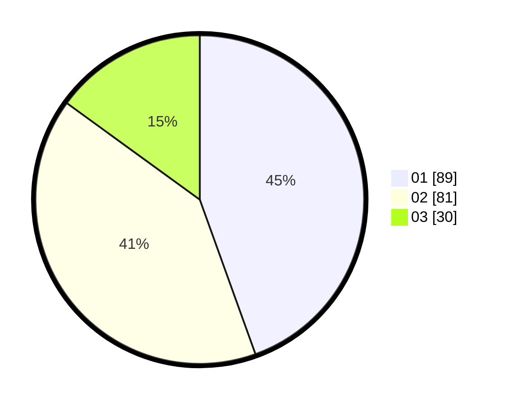

# Hasil

Hasil perolehan suara paslon dapat dilihat pada file paslon-01.txt, paslon-02.txt, dan paslon-03.txt.

Jika tidak ada, artinya data tersebut belum ada pada SIREKAP.

## Perolehan Suara

 * Paslon 01: **89**.
 * Paslon 02: **81**.
 * Paslon 03: **30**.

## Foto C Plano

https://sirekap-obj-formc.kpu.go.id/ccd9/pemilu/ppwp/31/74/05/10/03/3174051003004-20240214-195459--c12cfff4-b6ef-473f-b37e-854931639656.jpg

https://sirekap-obj-formc.kpu.go.id/ccd9/pemilu/ppwp/31/74/05/10/03/3174051003004-20240214-192034--fc903652-cc24-412e-89ae-e71ddf475287.jpg

https://sirekap-obj-formc.kpu.go.id/ccd9/pemilu/ppwp/31/74/05/10/03/3174051003004-20240214-192119--0a1cdc27-ca51-4f2b-8658-5ceb7be59bf8.jpg

## DATA PEMILIH TETAP

Jumlah pemilih dalam DPT: **267**.
 * L: **127**.
 * P: **140**.

## DATA PENGGUNA HAK PILIH

Jumlah pengguna hak pilih dalam DPT: **203**.
 * L: **95**.
 * P: **108**.

Jumlah pengguna hak pilih dalam DPTb: **0**.
 * L: **0**.
 * P: **0**.

Jumlah pengguna hak pilih dalam DPK: **0**.
 * L: **0**.
 * P: **0**.

Jumlah pengguna hak pilih: **203**.
 * L: **95**.
 * P: **108**.

## JUMLAH SUARA SAH DAN TIDAK SAH

JUMLAH SELURUH SUARA SAH: **200**.

JUMLAH SUARA TIDAK SAH: **3**.

JUMLAH SELURUH SUARA SAH DAN SUARA TIDAK SAH: **203**.
