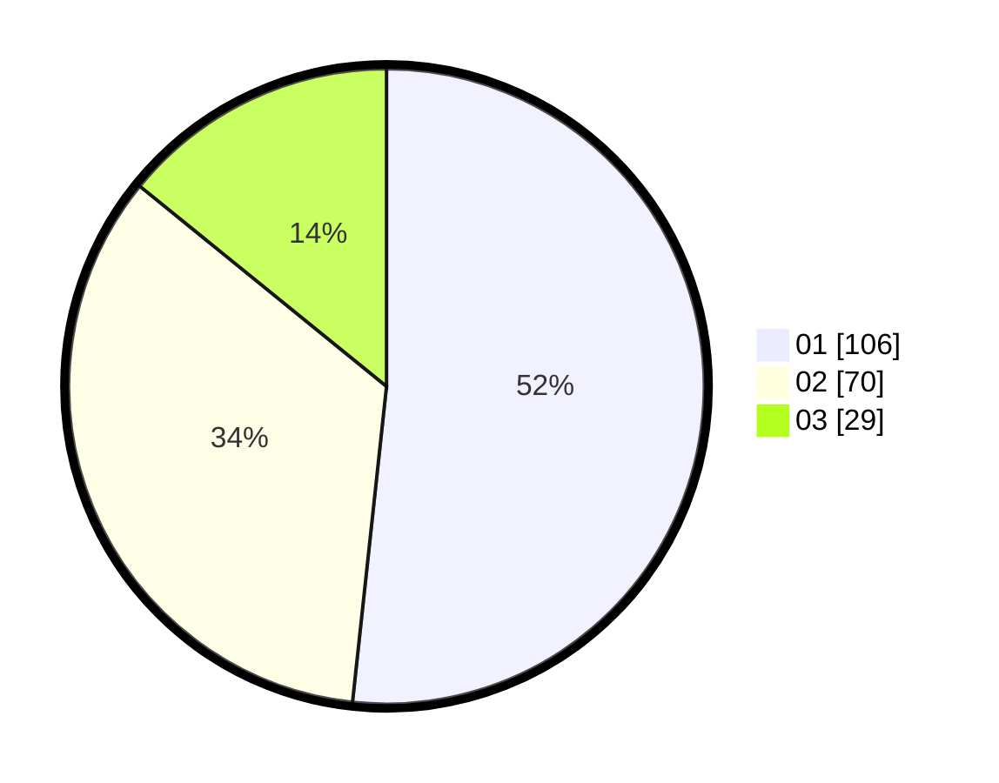

# Hasil

Hasil perolehan suara paslon dapat dilihat pada file paslon-01.txt, paslon-02.txt, dan paslon-03.txt.

Jika tidak ada, artinya data tersebut belum ada pada SIREKAP.

## Perolehan Suara

 * Paslon 01: **106**.
 * Paslon 02: **70**.
 * Paslon 03: **29**.

## Foto C Plano

https://sirekap-obj-formc.kpu.go.id/0096/pemilu/ppwp/31/74/05/10/03/3174051003010-20240214-210117--3b994914-43a0-4373-9758-1484a59fa591.jpg

https://sirekap-obj-formc.kpu.go.id/0096/pemilu/ppwp/31/74/05/10/03/3174051003010-20240214-210122--5c94d125-f4de-47a6-8a05-a3823adc1841.jpg

https://sirekap-obj-formc.kpu.go.id/0096/pemilu/ppwp/31/74/05/10/03/3174051003010-20240214-210127--945ebb30-fa4d-4463-909b-987bf6143f61.jpg

## DATA PEMILIH TETAP

Jumlah pemilih dalam DPT: **270**.
 * L: **120**.
 * P: **150**.

## DATA PENGGUNA HAK PILIH

Jumlah pengguna hak pilih dalam DPT: **205**.
 * L: **84**.
 * P: **121**.

Jumlah pengguna hak pilih dalam DPTb: **2**.
 * L: **2**.
 * P: **0**.

Jumlah pengguna hak pilih dalam DPK: **0**.
 * L: **0**.
 * P: **0**.

Jumlah pengguna hak pilih: **207**.
 * L: **86**.
 * P: **121**.

## JUMLAH SUARA SAH DAN TIDAK SAH

JUMLAH SELURUH SUARA SAH: **205**.

JUMLAH SUARA TIDAK SAH: **2**.

JUMLAH SELURUH SUARA SAH DAN SUARA TIDAK SAH: **207**.
