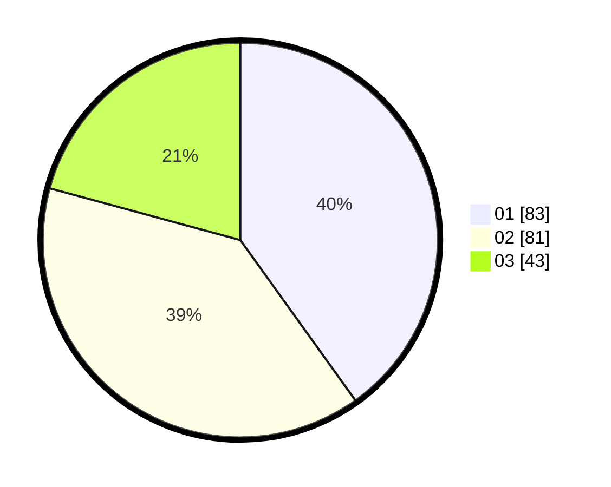

# Hasil

Hasil perolehan suara paslon dapat dilihat pada file paslon-01.txt, paslon-02.txt, dan paslon-03.txt.

Jika tidak ada, artinya data tersebut belum ada pada SIREKAP.

## Perolehan Suara

 * Paslon 01: **83**.
 * Paslon 02: **81**.
 * Paslon 03: **43**.

## Foto C Plano

https://sirekap-obj-formc.kpu.go.id/360e/pemilu/ppwp/31/74/05/10/03/3174051003012-20240214-191022--bc113b4d-dd1d-437a-a0b6-351cbc2f2e71.jpg

https://sirekap-obj-formc.kpu.go.id/360e/pemilu/ppwp/31/74/05/10/03/3174051003012-20240214-191144--77e71fc7-4daa-4c8c-83d6-a95f25c8cb50.jpg

https://sirekap-obj-formc.kpu.go.id/360e/pemilu/ppwp/31/74/05/10/03/3174051003012-20240214-191312--104b692b-bf16-412a-a744-377de5a2928b.jpg

## DATA PEMILIH TETAP

Jumlah pemilih dalam DPT: **247**.
 * L: **113**.
 * P: **134**.

## DATA PENGGUNA HAK PILIH

Jumlah pengguna hak pilih dalam DPT: **203**.
 * L: **92**.
 * P: **111**.

Jumlah pengguna hak pilih dalam DPTb: **0**.
 * L: **0**.
 * P: **0**.

Jumlah pengguna hak pilih dalam DPK: **4**.
 * L: **2**.
 * P: **2**.

Jumlah pengguna hak pilih: **207**.
 * L: **95**.
 * P: **112**.

## JUMLAH SUARA SAH DAN TIDAK SAH

JUMLAH SELURUH SUARA SAH: **207**.

JUMLAH SUARA TIDAK SAH: **0**.

JUMLAH SELURUH SUARA SAH DAN SUARA TIDAK SAH: **207**.
