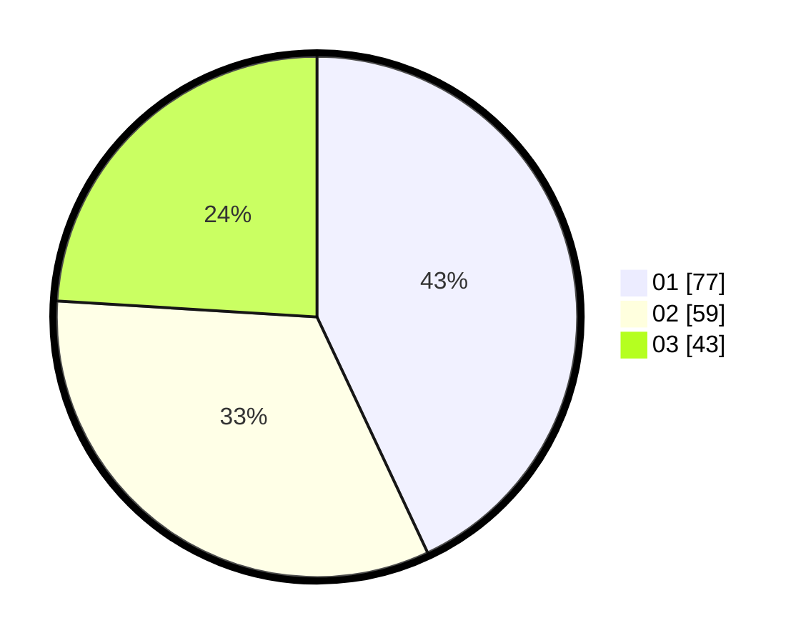

# Hasil

Hasil perolehan suara paslon dapat dilihat pada file paslon-01.txt, paslon-02.txt, dan paslon-03.txt.

Jika tidak ada, artinya data tersebut belum ada pada SIREKAP.

## Perolehan Suara

 * Paslon 01: **77**.
 * Paslon 02: **59**.
 * Paslon 03: **43**.

## Foto C Plano

https://sirekap-obj-formc.kpu.go.id/8de1/pemilu/ppwp/31/74/05/10/03/3174051003026-20240215-205933--acc0eac2-16e6-46cf-b32e-31055f01f544.jpg

https://sirekap-obj-formc.kpu.go.id/8de1/pemilu/ppwp/31/74/05/10/03/3174051003026-20240215-215207--8fe89bdc-63fb-4fe7-9989-6d2a85f98019.jpg

https://sirekap-obj-formc.kpu.go.id/8de1/pemilu/ppwp/31/74/05/10/03/3174051003026-20240214-222439--d0193309-70e8-4174-8f13-5bbff30197a7.jpg

## DATA PEMILIH TETAP

Jumlah pemilih dalam DPT: **262**.
 * L: **136**.
 * P: **126**.

## DATA PENGGUNA HAK PILIH

Jumlah pengguna hak pilih dalam DPT: **180**.
 * L: **93**.
 * P: **87**.

Jumlah pengguna hak pilih dalam DPTb: **2**.
 * L: **1**.
 * P: **1**.

Jumlah pengguna hak pilih dalam DPK: **0**.
 * L: **0**.
 * P: **0**.

Jumlah pengguna hak pilih: **182**.
 * L: **94**.
 * P: **88**.

## JUMLAH SUARA SAH DAN TIDAK SAH

JUMLAH SELURUH SUARA SAH: **179**.

JUMLAH SUARA TIDAK SAH: **3**.

JUMLAH SELURUH SUARA SAH DAN SUARA TIDAK SAH: **182**.
