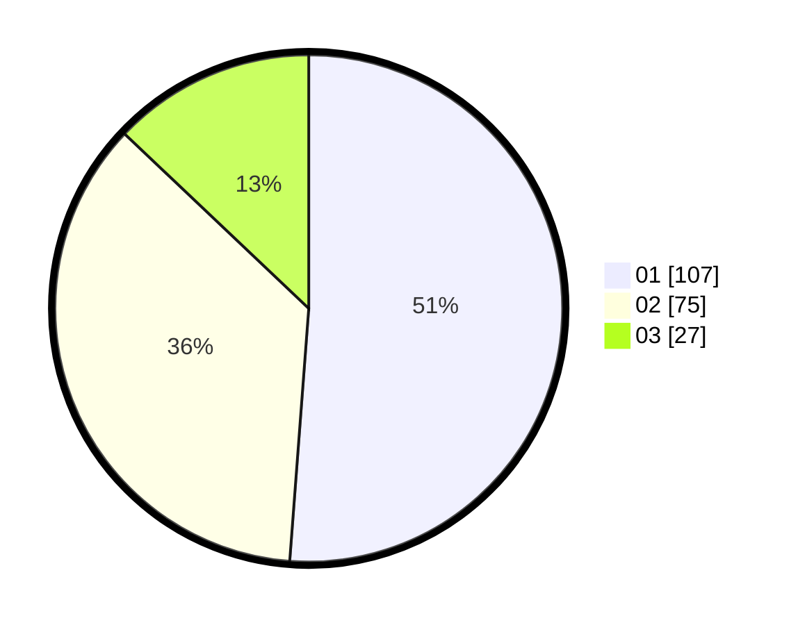

# Hasil

Hasil perolehan suara paslon dapat dilihat pada file paslon-01.txt, paslon-02.txt, dan paslon-03.txt.

Jika tidak ada, artinya data tersebut belum ada pada SIREKAP.

## Perolehan Suara

 * Paslon 01: **107**.
 * Paslon 02: **75**.
 * Paslon 03: **27**.

## Foto C Plano

https://sirekap-obj-formc.kpu.go.id/a297/pemilu/ppwp/31/74/05/10/03/3174051003038-20240214-190711--994d324c-353b-478b-9cd7-fedd446f4e5c.jpg

https://sirekap-obj-formc.kpu.go.id/a297/pemilu/ppwp/31/74/05/10/03/3174051003038-20240214-191626--ca61ccb0-7bf7-4ee3-a3f6-eb8bd64f3054.jpg

https://sirekap-obj-formc.kpu.go.id/a297/pemilu/ppwp/31/74/05/10/03/3174051003038-20240215-205139--88151e9f-2ade-4440-9ad6-adc9e2d1ec44.jpg

## DATA PEMILIH TETAP

Jumlah pemilih dalam DPT: **278**.
 * L: **144**.
 * P: **134**.

## DATA PENGGUNA HAK PILIH

Jumlah pengguna hak pilih dalam DPT: **211**.
 * L: **107**.
 * P: **104**.

Jumlah pengguna hak pilih dalam DPTb: **0**.
 * L: **0**.
 * P: **0**.

Jumlah pengguna hak pilih dalam DPK: **1**.
 * L: **0**.
 * P: **1**.

Jumlah pengguna hak pilih: **212**.
 * L: **107**.
 * P: **105**.

## JUMLAH SUARA SAH DAN TIDAK SAH

JUMLAH SELURUH SUARA SAH: **209**.

JUMLAH SUARA TIDAK SAH: **3**.

JUMLAH SELURUH SUARA SAH DAN SUARA TIDAK SAH: **212**.
