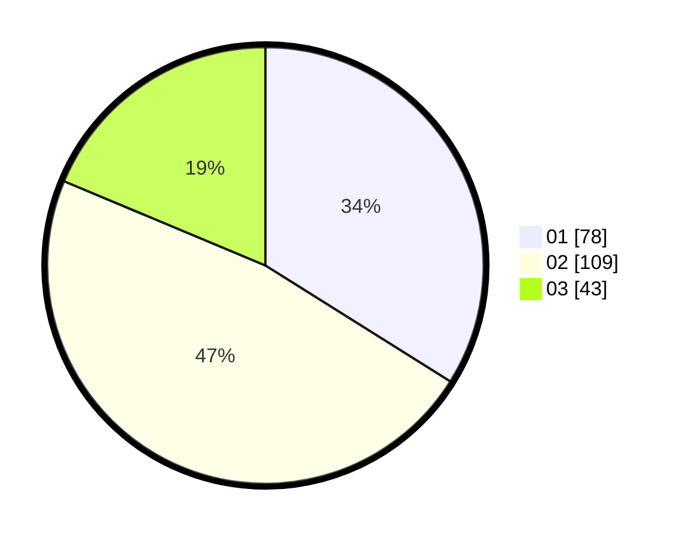

# Hasil

Hasil perolehan suara paslon dapat dilihat pada file paslon-01.txt, paslon-02.txt, dan paslon-03.txt.

Jika tidak ada, artinya data tersebut belum ada pada SIREKAP.

## Perolehan Suara

 * Paslon 01: **78**.
 * Paslon 02: **109**.
 * Paslon 03: **43**.

## Foto C Plano

https://sirekap-obj-formc.kpu.go.id/8a3b/pemilu/ppwp/31/74/05/10/03/3174051003039-20240215-040725--c233625b-83d3-474a-b8cc-70873e521e87.jpg

https://sirekap-obj-formc.kpu.go.id/8a3b/pemilu/ppwp/31/74/05/10/03/3174051003039-20240215-040748--8ee012d3-202c-41b9-8385-a39acf14ba20.jpg

https://sirekap-obj-formc.kpu.go.id/8a3b/pemilu/ppwp/31/74/05/10/03/3174051003039-20240215-040737--a69c000d-2b6d-4034-b64d-0c38dee0a693.jpg

## DATA PEMILIH TETAP

Jumlah pemilih dalam DPT: **219**.
 * L: **108**.
 * P: **111**.

## DATA PENGGUNA HAK PILIH

Jumlah pengguna hak pilih dalam DPT: **219**.
 * L: **108**.
 * P: **111**.

Jumlah pengguna hak pilih dalam DPTb: **7**.
 * L: **1**.
 * P: **6**.

Jumlah pengguna hak pilih dalam DPK: **5**.
 * L: **3**.
 * P: **2**.

Jumlah pengguna hak pilih: **231**.
 * L: **112**.
 * P: **119**.

## JUMLAH SUARA SAH DAN TIDAK SAH

JUMLAH SELURUH SUARA SAH: **230**.

JUMLAH SUARA TIDAK SAH: **1**.

JUMLAH SELURUH SUARA SAH DAN SUARA TIDAK SAH: **231**.
