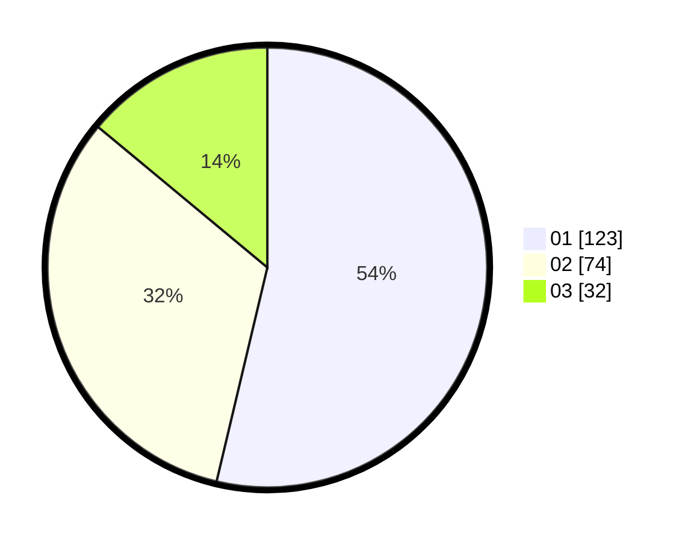

# Hasil

Hasil perolehan suara paslon dapat dilihat pada file paslon-01.txt, paslon-02.txt, dan paslon-03.txt.

Jika tidak ada, artinya data tersebut belum ada pada SIREKAP.

## Perolehan Suara

 * Paslon 01: **123**.
 * Paslon 02: **74**.
 * Paslon 03: **32**.

## Foto C Plano

https://sirekap-obj-formc.kpu.go.id/09e6/pemilu/ppwp/31/74/05/10/03/3174051003060-20240214-155139--5514d102-79dc-487d-a635-655442775bd7.jpg

https://sirekap-obj-formc.kpu.go.id/09e6/pemilu/ppwp/31/74/05/10/03/3174051003060-20240218-174226--b11be1ba-213e-4fa4-bbc6-a2b08d82eaeb.jpg
