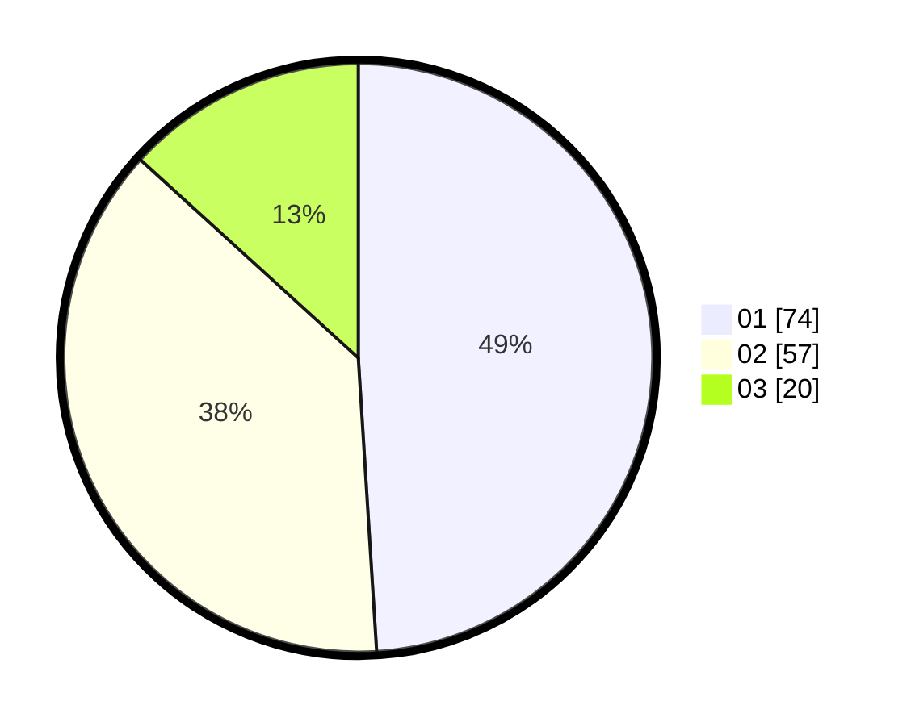

# Hasil

Hasil perolehan suara paslon dapat dilihat pada file paslon-01.txt, paslon-02.txt, dan paslon-03.txt.

Jika tidak ada, artinya data tersebut belum ada pada SIREKAP.

## Perolehan Suara

 * Paslon 01: **74**.
 * Paslon 02: **57**.
 * Paslon 03: **20**.

## Foto C Plano

https://sirekap-obj-formc.kpu.go.id/c560/pemilu/ppwp/31/74/05/10/03/3174051003064-20240214-191040--9669e507-d15f-425e-8e89-bc7fe34d1344.jpg

https://sirekap-obj-formc.kpu.go.id/c560/pemilu/ppwp/31/74/05/10/03/3174051003064-20240214-184506--bc502f9d-1282-4175-8406-4e2a66296083.jpg

https://sirekap-obj-formc.kpu.go.id/c560/pemilu/ppwp/31/74/05/10/03/3174051003064-20240214-190920--95f127f7-519a-4839-b2bc-d3313d743ae2.jpg

## DATA PEMILIH TETAP

Jumlah pemilih dalam DPT: **219**.
 * L: **105**.
 * P: **114**.

## DATA PENGGUNA HAK PILIH

Jumlah pengguna hak pilih dalam DPT: **156**.
 * L: **71**.
 * P: **85**.

Jumlah pengguna hak pilih dalam DPTb: **1**.
 * L: **1**.
 * P: **0**.

Jumlah pengguna hak pilih dalam DPK: **0**.
 * L: **0**.
 * P: **0**.

Jumlah pengguna hak pilih: **157**.
 * L: **72**.
 * P: **85**.

## JUMLAH SUARA SAH DAN TIDAK SAH

JUMLAH SELURUH SUARA SAH: **151**.

JUMLAH SUARA TIDAK SAH: **6**.

JUMLAH SELURUH SUARA SAH DAN SUARA TIDAK SAH: **157**.
