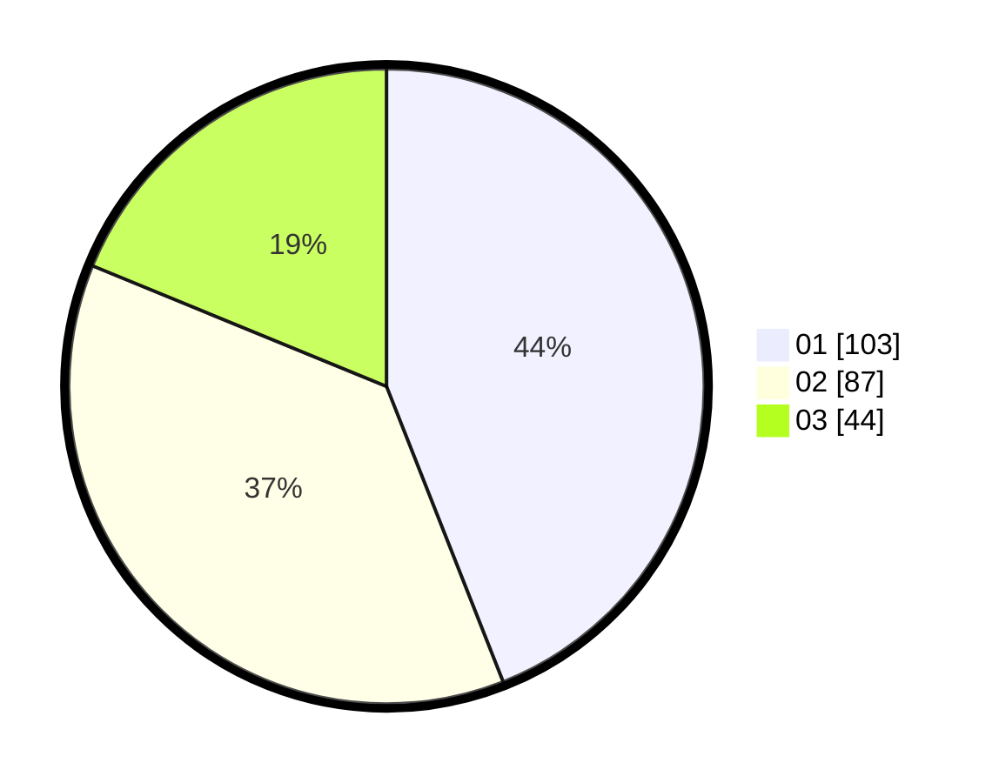

# Hasil

Hasil perolehan suara paslon dapat dilihat pada file paslon-01.txt, paslon-02.txt, dan paslon-03.txt.

Jika tidak ada, artinya data tersebut belum ada pada SIREKAP.

## Perolehan Suara

 * Paslon 01: **103**.
 * Paslon 02: **87**.
 * Paslon 03: **44**.

## Foto C Plano

https://sirekap-obj-formc.kpu.go.id/8416/pemilu/ppwp/31/74/05/10/03/3174051003087-20240216-015736--05f6e11c-dcdd-41a1-8000-7babae8e98da.jpg

https://sirekap-obj-formc.kpu.go.id/8416/pemilu/ppwp/31/74/05/10/03/3174051003087-20240216-015738--85ed3b44-f3df-4a38-8e81-9776aae96a7a.jpg

https://sirekap-obj-formc.kpu.go.id/8416/pemilu/ppwp/31/74/05/10/03/3174051003087-20240216-015737--b869ce83-04a5-4ee7-8d62-fa1071c56ec7.jpg

## DATA PEMILIH TETAP

Jumlah pemilih dalam DPT: **278**.
 * L: **130**.
 * P: **148**.

## DATA PENGGUNA HAK PILIH

Jumlah pengguna hak pilih dalam DPT: **228**.
 * L: **106**.
 * P: **122**.

Jumlah pengguna hak pilih dalam DPTb: **9**.
 * L: **6**.
 * P: **3**.

Jumlah pengguna hak pilih dalam DPK: **0**.
 * L: **0**.
 * P: **0**.

Jumlah pengguna hak pilih: **237**.
 * L: **112**.
 * P: **125**.

## JUMLAH SUARA SAH DAN TIDAK SAH

JUMLAH SELURUH SUARA SAH: **234**.

JUMLAH SUARA TIDAK SAH: **3**.

JUMLAH SELURUH SUARA SAH DAN SUARA TIDAK SAH: **237**.
