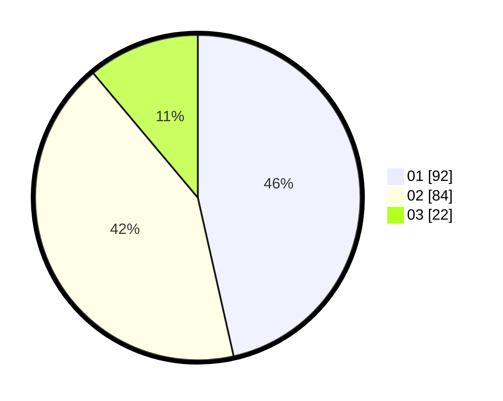

# Hasil

Hasil perolehan suara paslon dapat dilihat pada file paslon-01.txt, paslon-02.txt, dan paslon-03.txt.

Jika tidak ada, artinya data tersebut belum ada pada SIREKAP.

## Perolehan Suara

 * Paslon 01: **92**.
 * Paslon 02: **84**.
 * Paslon 03: **22**.

## Foto C Plano

https://sirekap-obj-formc.kpu.go.id/e7c5/pemilu/ppwp/31/74/05/10/03/3174051003094-20240214-212545--e8d96f48-c23a-4ac4-8455-a690c2abaa77.jpg

https://sirekap-obj-formc.kpu.go.id/e7c5/pemilu/ppwp/31/74/05/10/03/3174051003094-20240214-212649--358ccacb-24da-49f6-a594-e037b6fb5a68.jpg

https://sirekap-obj-formc.kpu.go.id/e7c5/pemilu/ppwp/31/74/05/10/03/3174051003094-20240214-212741--742faae6-16e0-4478-8e28-808e1e88c689.jpg

## DATA PEMILIH TETAP

Jumlah pemilih dalam DPT: **274**.
 * L: **130**.
 * P: **144**.

## DATA PENGGUNA HAK PILIH

Jumlah pengguna hak pilih dalam DPT: **199**.
 * L: **93**.
 * P: **106**.

Jumlah pengguna hak pilih dalam DPTb: **2**.
 * L: **0**.
 * P: **2**.

Jumlah pengguna hak pilih dalam DPK: **0**.
 * L: **0**.
 * P: **0**.

Jumlah pengguna hak pilih: **201**.
 * L: **93**.
 * P: **108**.

## JUMLAH SUARA SAH DAN TIDAK SAH

JUMLAH SELURUH SUARA SAH: **198**.

JUMLAH SUARA TIDAK SAH: **3**.

JUMLAH SELURUH SUARA SAH DAN SUARA TIDAK SAH: **201**.
