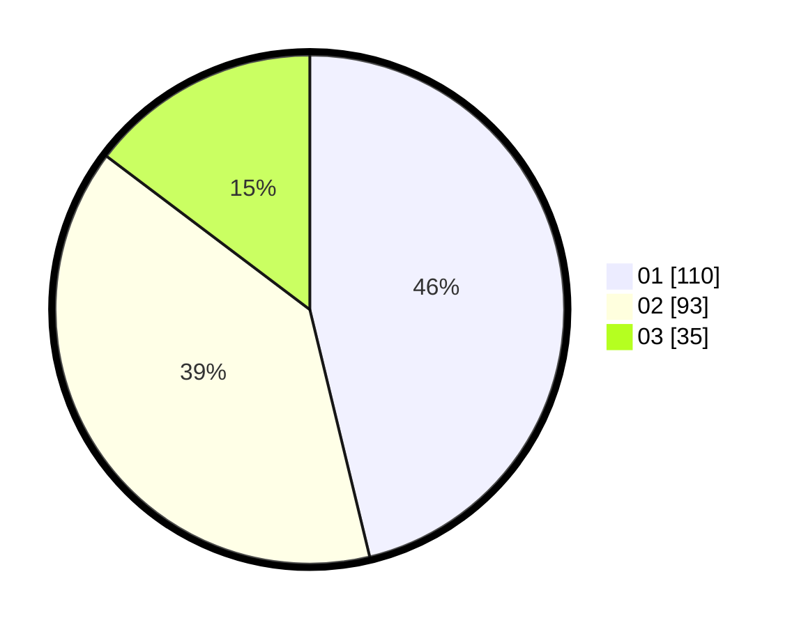

# Hasil

Hasil perolehan suara paslon dapat dilihat pada file paslon-01.txt, paslon-02.txt, dan paslon-03.txt.

Jika tidak ada, artinya data tersebut belum ada pada SIREKAP.

## Perolehan Suara

 * Paslon 01: **110**.
 * Paslon 02: **93**.
 * Paslon 03: **35**.

## Foto C Plano

https://sirekap-obj-formc.kpu.go.id/7845/pemilu/ppwp/31/74/05/10/03/3174051003102-20240214-193625--31feddf8-4750-4c91-a256-916f7a25765e.jpg

https://sirekap-obj-formc.kpu.go.id/7845/pemilu/ppwp/31/74/05/10/03/3174051003102-20240214-193903--6dd2db7f-0684-464d-8715-7d90b5e520bc.jpg

https://sirekap-obj-formc.kpu.go.id/7845/pemilu/ppwp/31/74/05/10/03/3174051003102-20240214-194014--6eda6fe5-cfc6-4eb8-860f-645af146b31e.jpg

## DATA PEMILIH TETAP

Jumlah pemilih dalam DPT: **282**.
 * L: **142**.
 * P: **140**.

## DATA PENGGUNA HAK PILIH

Jumlah pengguna hak pilih dalam DPT: **239**.
 * L: **117**.
 * P: **122**.

Jumlah pengguna hak pilih dalam DPTb: **3**.
 * L: **1**.
 * P: **2**.

Jumlah pengguna hak pilih dalam DPK: **0**.
 * L: **0**.
 * P: **0**.

Jumlah pengguna hak pilih: **242**.
 * L: **118**.
 * P: **124**.

## JUMLAH SUARA SAH DAN TIDAK SAH

JUMLAH SELURUH SUARA SAH: **238**.

JUMLAH SUARA TIDAK SAH: **4**.

JUMLAH SELURUH SUARA SAH DAN SUARA TIDAK SAH: **242**.
