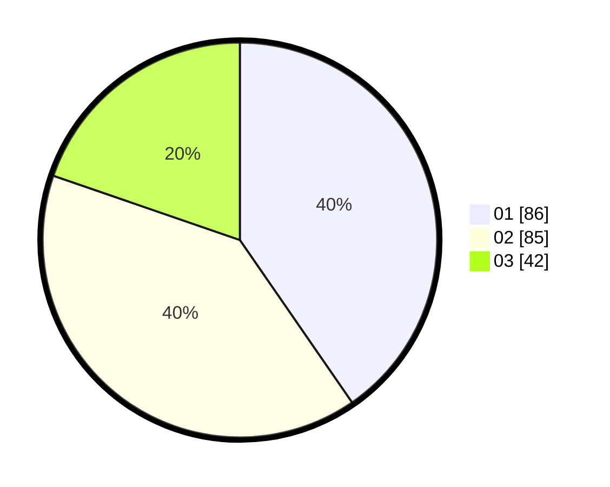

# Hasil

Hasil perolehan suara paslon dapat dilihat pada file paslon-01.txt, paslon-02.txt, dan paslon-03.txt.

Jika tidak ada, artinya data tersebut belum ada pada SIREKAP.

## Perolehan Suara

 * Paslon 01: **86**.
 * Paslon 02: **85**.
 * Paslon 03: **42**.

## Foto C Plano

https://sirekap-obj-formc.kpu.go.id/ba1a/pemilu/ppwp/31/74/05/10/03/3174051003113-20240218-170339--8a97e1c5-1966-49c4-8d25-723ff71a449e.jpg

https://sirekap-obj-formc.kpu.go.id/ba1a/pemilu/ppwp/31/74/05/10/03/3174051003113-20240218-155143--13574bd8-9290-4a64-9b72-9ac3eae9fe30.jpg

https://sirekap-obj-formc.kpu.go.id/ba1a/pemilu/ppwp/31/74/05/10/03/3174051003113-20240218-155417--f1f0fc5f-89dc-4e83-bdbe-38387d2f74fb.jpg

## DATA PEMILIH TETAP

Jumlah pemilih dalam DPT: **256**.
 * L: **126**.
 * P: **130**.

## DATA PENGGUNA HAK PILIH

Jumlah pengguna hak pilih dalam DPT: **217**.
 * L: **109**.
 * P: **108**.

Jumlah pengguna hak pilih dalam DPTb: **4**.
 * L: **2**.
 * P: **2**.

Jumlah pengguna hak pilih dalam DPK: **0**.
 * L: **0**.
 * P: **0**.

Jumlah pengguna hak pilih: **221**.
 * L: **111**.
 * P: **110**.

## JUMLAH SUARA SAH DAN TIDAK SAH

JUMLAH SELURUH SUARA SAH: **213**.

JUMLAH SUARA TIDAK SAH: **8**.

JUMLAH SELURUH SUARA SAH DAN SUARA TIDAK SAH: **221**.
