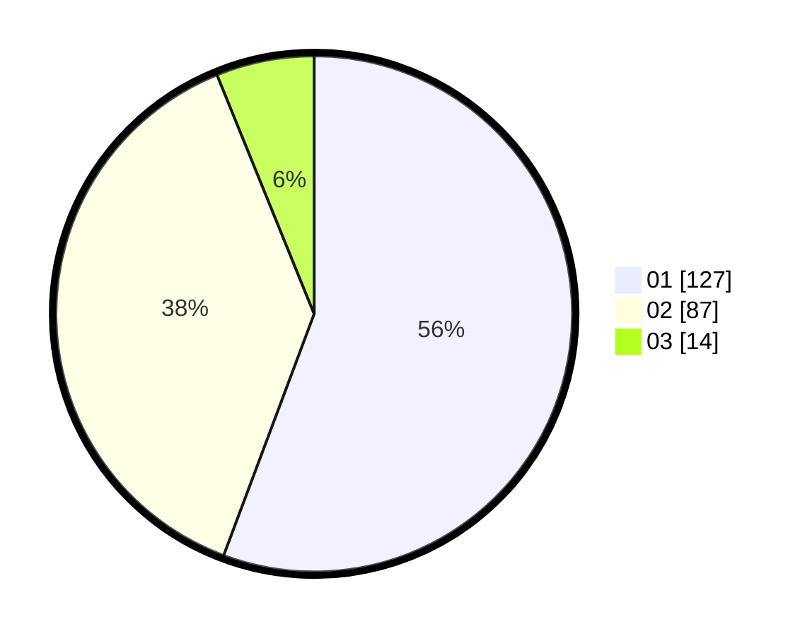

# Hasil

Hasil perolehan suara paslon dapat dilihat pada file paslon-01.txt, paslon-02.txt, dan paslon-03.txt.

Jika tidak ada, artinya data tersebut belum ada pada SIREKAP.

## Perolehan Suara

 * Paslon 01: **127**.
 * Paslon 02: **87**.
 * Paslon 03: **14**.

## Foto C Plano

https://sirekap-obj-formc.kpu.go.id/71c1/pemilu/ppwp/31/74/05/10/03/3174051003129-20240215-000151--8fda2710-7184-4e02-92e5-f256c1c3d7e1.jpg

https://sirekap-obj-formc.kpu.go.id/71c1/pemilu/ppwp/31/74/05/10/03/3174051003129-20240219-101915--1b1b6a0a-1c50-4518-9362-5f1f51355514.jpg

https://sirekap-obj-formc.kpu.go.id/71c1/pemilu/ppwp/31/74/05/10/03/3174051003129-20240219-102645--33b5c1ea-8faa-4b67-ba56-2f80169a9510.jpg
