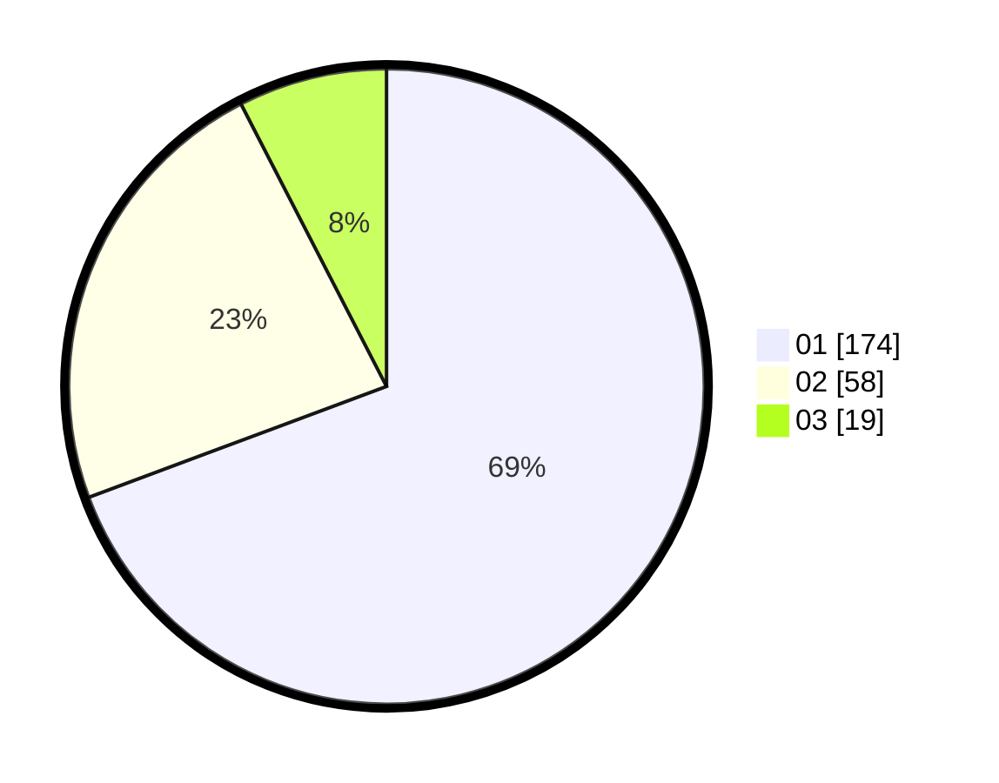

# Hasil

Hasil perolehan suara paslon dapat dilihat pada file paslon-01.txt, paslon-02.txt, dan paslon-03.txt.

Jika tidak ada, artinya data tersebut belum ada pada SIREKAP.

## Perolehan Suara

 * Paslon 01: **174**.
 * Paslon 02: **58**.
 * Paslon 03: **19**.

## Foto C Plano

https://sirekap-obj-formc.kpu.go.id/9ebd/pemilu/ppwp/31/74/05/10/04/3174051004006-20240215-215647--78d5a838-8c75-45bd-9141-5f047386932d.jpg

https://sirekap-obj-formc.kpu.go.id/9ebd/pemilu/ppwp/31/74/05/10/04/3174051004006-20240215-215649--85a4ba5f-f84e-4cb4-bc7f-8eba2a951a91.jpg

https://sirekap-obj-formc.kpu.go.id/9ebd/pemilu/ppwp/31/74/05/10/04/3174051004006-20240215-215648--c63ff2e3-7719-4618-b41a-d0d8071cef08.jpg

## DATA PEMILIH TETAP

Jumlah pemilih dalam DPT: **297**.
 * L: **161**.
 * P: **136**.

## DATA PENGGUNA HAK PILIH

Jumlah pengguna hak pilih dalam DPT: **246**.
 * L: **126**.
 * P: **120**.

Jumlah pengguna hak pilih dalam DPTb: **4**.
 * L: **2**.
 * P: **2**.

Jumlah pengguna hak pilih dalam DPK: **2**.
 * L: **1**.
 * P: **1**.

Jumlah pengguna hak pilih: **252**.
 * L: **129**.
 * P: **123**.

## JUMLAH SUARA SAH DAN TIDAK SAH

JUMLAH SELURUH SUARA SAH: **251**.

JUMLAH SUARA TIDAK SAH: **1**.

JUMLAH SELURUH SUARA SAH DAN SUARA TIDAK SAH: **252**.
