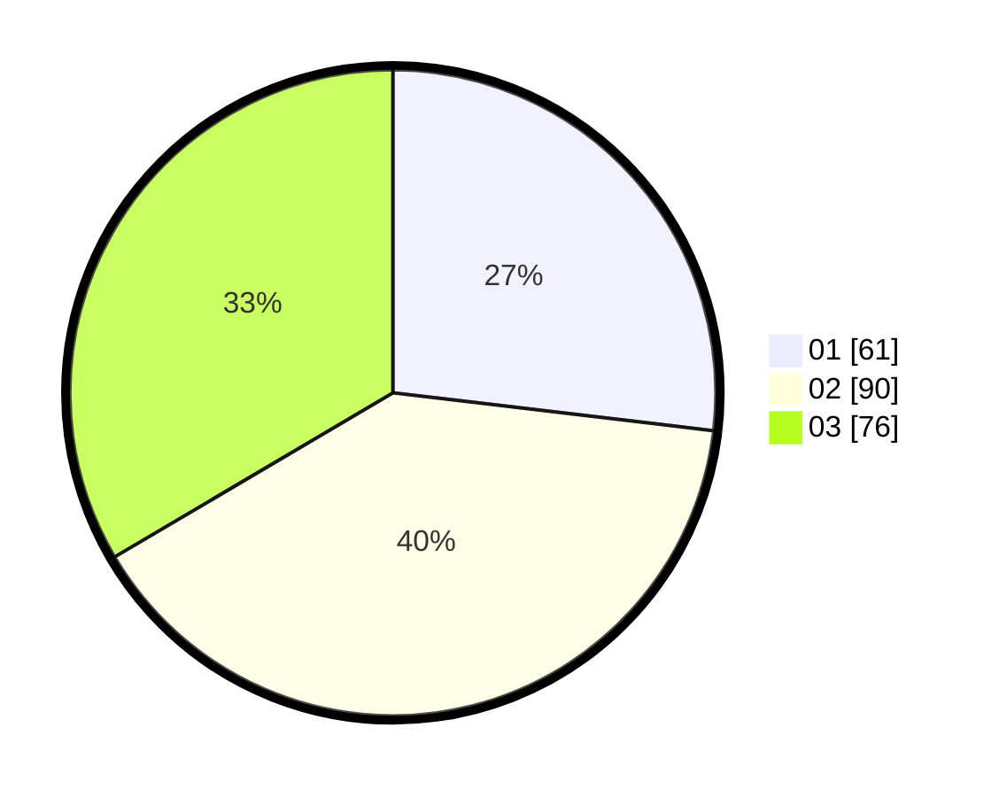

# Hasil

Hasil perolehan suara paslon dapat dilihat pada file paslon-01.txt, paslon-02.txt, dan paslon-03.txt.

Jika tidak ada, artinya data tersebut belum ada pada SIREKAP.

## Perolehan Suara

 * Paslon 01: **61**.
 * Paslon 02: **90**.
 * Paslon 03: **76**.

## Foto C Plano

https://sirekap-obj-formc.kpu.go.id/3dc4/pemilu/ppwp/31/74/05/10/04/3174051004008-20240214-200902--7a97a1f5-ba3a-4d21-826c-78708ad1d4be.jpg

https://sirekap-obj-formc.kpu.go.id/3dc4/pemilu/ppwp/31/74/05/10/04/3174051004008-20240214-193859--acee2c45-91d2-45ae-b781-5ffd258719ee.jpg

https://sirekap-obj-formc.kpu.go.id/3dc4/pemilu/ppwp/31/74/05/10/04/3174051004008-20240214-192627--e2e6f1b9-2314-4f52-b53b-a7ad0487de2d.jpg

## DATA PEMILIH TETAP

Jumlah pemilih dalam DPT: **296**.
 * L: **139**.
 * P: **157**.

## DATA PENGGUNA HAK PILIH

Jumlah pengguna hak pilih dalam DPT: **206**.
 * L: **94**.
 * P: **112**.

Jumlah pengguna hak pilih dalam DPTb: **14**.
 * L: **5**.
 * P: **9**.

Jumlah pengguna hak pilih dalam DPK: **8**.
 * L: **2**.
 * P: **6**.

Jumlah pengguna hak pilih: **228**.
 * L: **101**.
 * P: **127**.

## JUMLAH SUARA SAH DAN TIDAK SAH

JUMLAH SELURUH SUARA SAH: **227**.

JUMLAH SUARA TIDAK SAH: **1**.

JUMLAH SELURUH SUARA SAH DAN SUARA TIDAK SAH: **228**.
