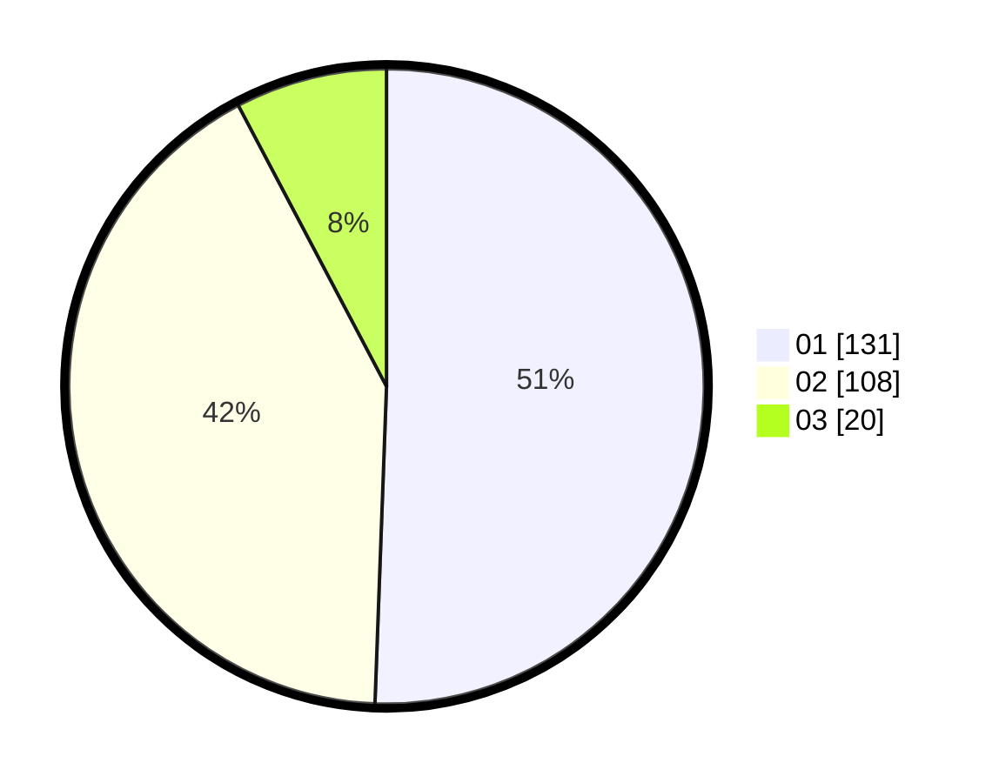

# Hasil

Hasil perolehan suara paslon dapat dilihat pada file paslon-01.txt, paslon-02.txt, dan paslon-03.txt.

Jika tidak ada, artinya data tersebut belum ada pada SIREKAP.

## Perolehan Suara

 * Paslon 01: **131**.
 * Paslon 02: **108**.
 * Paslon 03: **20**.

## Foto C Plano

https://sirekap-obj-formc.kpu.go.id/7c44/pemilu/ppwp/31/74/05/10/04/3174051004010-20240216-033436--90270370-4d17-478f-ad3f-c2865423ceb7.jpg

https://sirekap-obj-formc.kpu.go.id/7c44/pemilu/ppwp/31/74/05/10/04/3174051004010-20240216-033437--0dacd952-c9bc-4247-903d-a69a6a0d41bf.jpg

https://sirekap-obj-formc.kpu.go.id/7c44/pemilu/ppwp/31/74/05/10/04/3174051004010-20240216-033437--9765eab1-70e5-4125-81c9-d2d5b8245d19.jpg

## DATA PEMILIH TETAP

Jumlah pemilih dalam DPT: **288**.
 * L: **138**.
 * P: **150**.

## DATA PENGGUNA HAK PILIH

Jumlah pengguna hak pilih dalam DPT: **251**.
 * L: **122**.
 * P: **129**.

Jumlah pengguna hak pilih dalam DPTb: **11**.
 * L: **4**.
 * P: **7**.

Jumlah pengguna hak pilih dalam DPK: **1**.
 * L: **1**.
 * P: **0**.

Jumlah pengguna hak pilih: **263**.
 * L: **127**.
 * P: **136**.

## JUMLAH SUARA SAH DAN TIDAK SAH

JUMLAH SELURUH SUARA SAH: **259**.

JUMLAH SUARA TIDAK SAH: **4**.

JUMLAH SELURUH SUARA SAH DAN SUARA TIDAK SAH: **263**.
