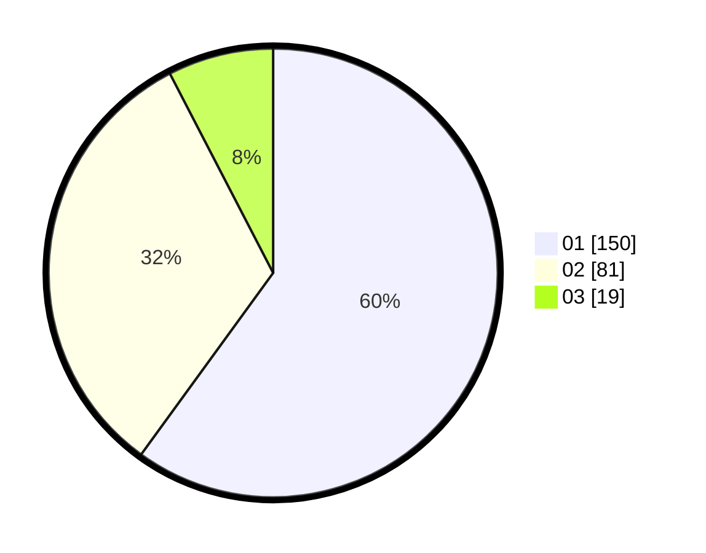

# Hasil

Hasil perolehan suara paslon dapat dilihat pada file paslon-01.txt, paslon-02.txt, dan paslon-03.txt.

Jika tidak ada, artinya data tersebut belum ada pada SIREKAP.

## Perolehan Suara

 * Paslon 01: **150**.
 * Paslon 02: **81**.
 * Paslon 03: **19**.

## Foto C Plano

https://sirekap-obj-formc.kpu.go.id/f249/pemilu/ppwp/31/74/05/10/04/3174051004012-20240215-215128--601ff8bf-24d5-4bc8-b932-3098653c504c.jpg

https://sirekap-obj-formc.kpu.go.id/f249/pemilu/ppwp/31/74/05/10/04/3174051004012-20240214-193602--55aa9445-a315-438a-821f-fcd1fa62ebc6.jpg

https://sirekap-obj-formc.kpu.go.id/f249/pemilu/ppwp/31/74/05/10/04/3174051004012-20240214-193910--cd184b40-296c-4a03-9876-1acdf0f767b1.jpg

## DATA PEMILIH TETAP

Jumlah pemilih dalam DPT: **291**.
 * L: **141**.
 * P: **150**.

## DATA PENGGUNA HAK PILIH

Jumlah pengguna hak pilih dalam DPT: **246**.
 * L: **118**.
 * P: **128**.

Jumlah pengguna hak pilih dalam DPTb: **4**.
 * L: **2**.
 * P: **2**.

Jumlah pengguna hak pilih dalam DPK: **0**.
 * L: **0**.
 * P: **0**.

Jumlah pengguna hak pilih: **250**.
 * L: **120**.
 * P: **130**.

## JUMLAH SUARA SAH DAN TIDAK SAH

JUMLAH SELURUH SUARA SAH: **250**.

JUMLAH SUARA TIDAK SAH: **0**.

JUMLAH SELURUH SUARA SAH DAN SUARA TIDAK SAH: **250**.
