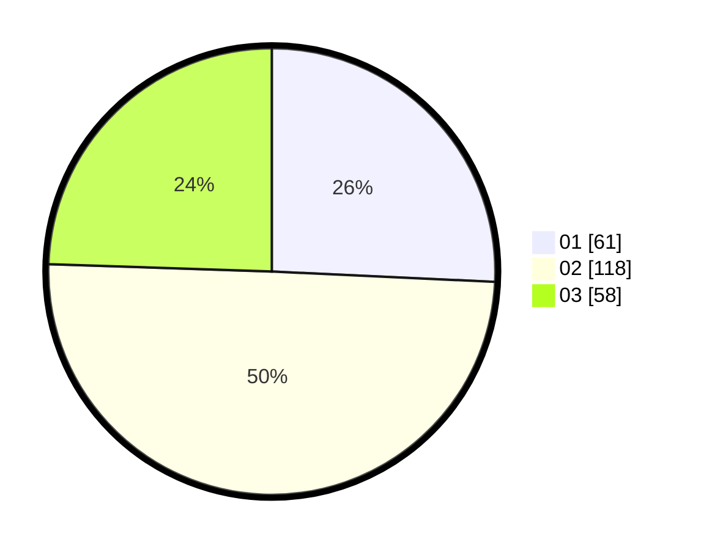

# Hasil

Hasil perolehan suara paslon dapat dilihat pada file paslon-01.txt, paslon-02.txt, dan paslon-03.txt.

Jika tidak ada, artinya data tersebut belum ada pada SIREKAP.

## Perolehan Suara

 * Paslon 01: **61**.
 * Paslon 02: **118**.
 * Paslon 03: **58**.

## Foto C Plano

https://sirekap-obj-formc.kpu.go.id/be21/pemilu/ppwp/31/74/05/10/04/3174051004030-20240216-003044--c41aaa32-8358-4c85-b069-d2f422b74b84.jpg

https://sirekap-obj-formc.kpu.go.id/be21/pemilu/ppwp/31/74/05/10/04/3174051004030-20240216-003048--bff90c89-bee2-4837-b59f-19ae033ac90c.jpg

https://sirekap-obj-formc.kpu.go.id/be21/pemilu/ppwp/31/74/05/10/04/3174051004030-20240216-003047--37db5c57-1055-4ce8-b81d-00673c5946d7.jpg

## DATA PEMILIH TETAP

Jumlah pemilih dalam DPT: **294**.
 * L: **149**.
 * P: **145**.

## DATA PENGGUNA HAK PILIH

Jumlah pengguna hak pilih dalam DPT: **237**.
 * L: **119**.
 * P: **118**.

Jumlah pengguna hak pilih dalam DPTb: **7**.
 * L: **4**.
 * P: **3**.

Jumlah pengguna hak pilih dalam DPK: **0**.
 * L: **0**.
 * P: **0**.

Jumlah pengguna hak pilih: **244**.
 * L: **123**.
 * P: **121**.

## JUMLAH SUARA SAH DAN TIDAK SAH

JUMLAH SELURUH SUARA SAH: **237**.

JUMLAH SUARA TIDAK SAH: **7**.

JUMLAH SELURUH SUARA SAH DAN SUARA TIDAK SAH: **244**.
