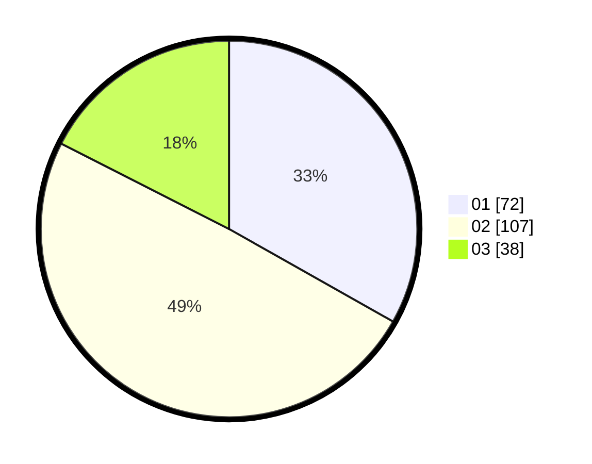

# Hasil

Hasil perolehan suara paslon dapat dilihat pada file paslon-01.txt, paslon-02.txt, dan paslon-03.txt.

Jika tidak ada, artinya data tersebut belum ada pada SIREKAP.

## Perolehan Suara

 * Paslon 01: **72**.
 * Paslon 02: **107**.
 * Paslon 03: **38**.

## Foto C Plano

https://sirekap-obj-formc.kpu.go.id/d4e1/pemilu/ppwp/31/74/05/10/04/3174051004039-20240215-234706--e6b816cd-4228-40fd-a4b1-f9e1b78e50ab.jpg

https://sirekap-obj-formc.kpu.go.id/d4e1/pemilu/ppwp/31/74/05/10/04/3174051004039-20240215-234712--6cf54de9-7715-42b3-b7ea-ec8cf13c1257.jpg

https://sirekap-obj-formc.kpu.go.id/d4e1/pemilu/ppwp/31/74/05/10/04/3174051004039-20240215-234708--5a2d7358-8141-48f8-8206-c6d948091573.jpg

## DATA PEMILIH TETAP

Jumlah pemilih dalam DPT: **277**.
 * L: **147**.
 * P: **130**.

## DATA PENGGUNA HAK PILIH

Jumlah pengguna hak pilih dalam DPT: **217**.
 * L: **110**.
 * P: **107**.

Jumlah pengguna hak pilih dalam DPTb: **1**.
 * L: **0**.
 * P: **1**.

Jumlah pengguna hak pilih dalam DPK: **0**.
 * L: **0**.
 * P: **0**.

Jumlah pengguna hak pilih: **218**.
 * L: **110**.
 * P: **108**.

## JUMLAH SUARA SAH DAN TIDAK SAH

JUMLAH SELURUH SUARA SAH: **217**.

JUMLAH SUARA TIDAK SAH: **1**.

JUMLAH SELURUH SUARA SAH DAN SUARA TIDAK SAH: **218**.
